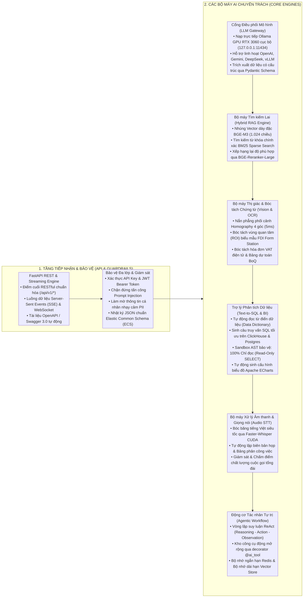

# QUY CHUẨN KIẾN TRÚC VÀ PHÁT TRIỂN NỀN TẢNG TRÍ TUỆ NHÂN TẠO (MIAI)

Tài liệu này quy định toàn bộ tiêu chuẩn kiến trúc, quy tắc lập trình và chuẩn mực thiết kế cho nền tảng Trí tuệ Nhân tạo `miai`, kế thừa và phát triển từ tài liệu nghiên cứu `docsbase/rd/deploy-ai-tool.md` và `docsbase/rd/micro-server.md`.

---

## 1. TỔNG QUAN KIẾN TRÚC VÀ TÔ PÔ HẠ TẦNG



---

## 2. NGUYÊN TẮC THIẾT KẾ CỐT LÕI

### 2.1. Cấu trúc mã nguồn Clean Architecture & Ports and Adapters
* Toàn bộ mã nguồn phải được tổ chức tách biệt rõ ràng theo từng phân tầng:
  * `src/api/`: Tiếp nhận HTTP Request, Dependency Injection, chuyển tiếp tới Engines, trả về `ApiResponse`.
  * `src/core/`: Quản lý cấu hình (`Settings`), cơ sở dữ liệu (`database.py`), bảo mật (`security.py`), lớp bảo vệ (`guardrails.py`), telemetry & logger.
  * `src/engines/`: 6 bộ máy nghiệp vụ AI độc lập, không phụ thuộc chéo vòng tròn.
  * `src/schemas/`: 100% Pydantic Schemas mô hình hóa Request/Response.

### 2.2. Nguyên tắc Zero-Hardcode và Quản trị Đối tượng
* Toàn bộ mã trạng thái, phân loại, vai trò và mã lỗi **bắt buộc phải được định nghĩa bằng Enum trong `core/constants.py`**.
* Cấm dùng chuỗi tự do (String Literal) để so sánh điều kiện.
* Dữ liệu trả về không gán giá trị giả lập; nếu chưa có dữ liệu phải để `null` hoặc danh sách rỗng `[]`.

### 2.3. Quy chuẩn Bảo vệ Dữ liệu và An toàn Mô hình
* **Prompt Injection Defense:** Tất cả đầu vào người dùng trước khi gửi tới mô hình LLM phải đi qua bộ lọc `InputGuardrail` để phát hiện và ngăn chặn các mẫu tấn công chiếm quyền điều khiển prompt (System override, Jailbreak, tiếng Việt và tiếng Anh).
* **PII Redaction:** Tự động phát hiện và làm mờ các thông tin nhạy cảm (Số CMND/CCCD, Mã số thuế, Số thẻ tín dụng, Số điện thoại) trước khi gửi tới các API bên ngoài.
* **AST SQL Sandbox:** Tất cả câu lệnh SQL sinh bởi mô hình Text-to-SQL phải được phân tích cú pháp AST bằng `sqlparse`. Chỉ cho phép duy nhất lệnh `SELECT`, cấm tuyệt đối các câu lệnh thay đổi dữ liệu (`DROP`, `DELETE`, `INSERT`, `UPDATE`, `ALTER`, `TRUNCATE`) và câu lệnh xếp chồng (Stacked Queries).

---

## 3. CHUẨN MỰC GIAO TIẾP VÀ PHẢN HỒI API

Mọi API của hệ thống phải trả về cấu trúc đối tượng chuẩn hóa `ApiResponse`:

```json
{
  "code": "SUCCESS",
  "message": "Thực thi thành công",
  "data": { ... },
  "duration_ms": 42.5
}
```

Trường hợp phát sinh lỗi:
```json
{
  "code": "ERR_VALIDATION_FAILED",
  "message": "Câu truy vấn SQL không an toàn: Chỉ cho phép lệnh SELECT đọc dữ liệu",
  "data": null,
  "duration_ms": 1.2
}
```
