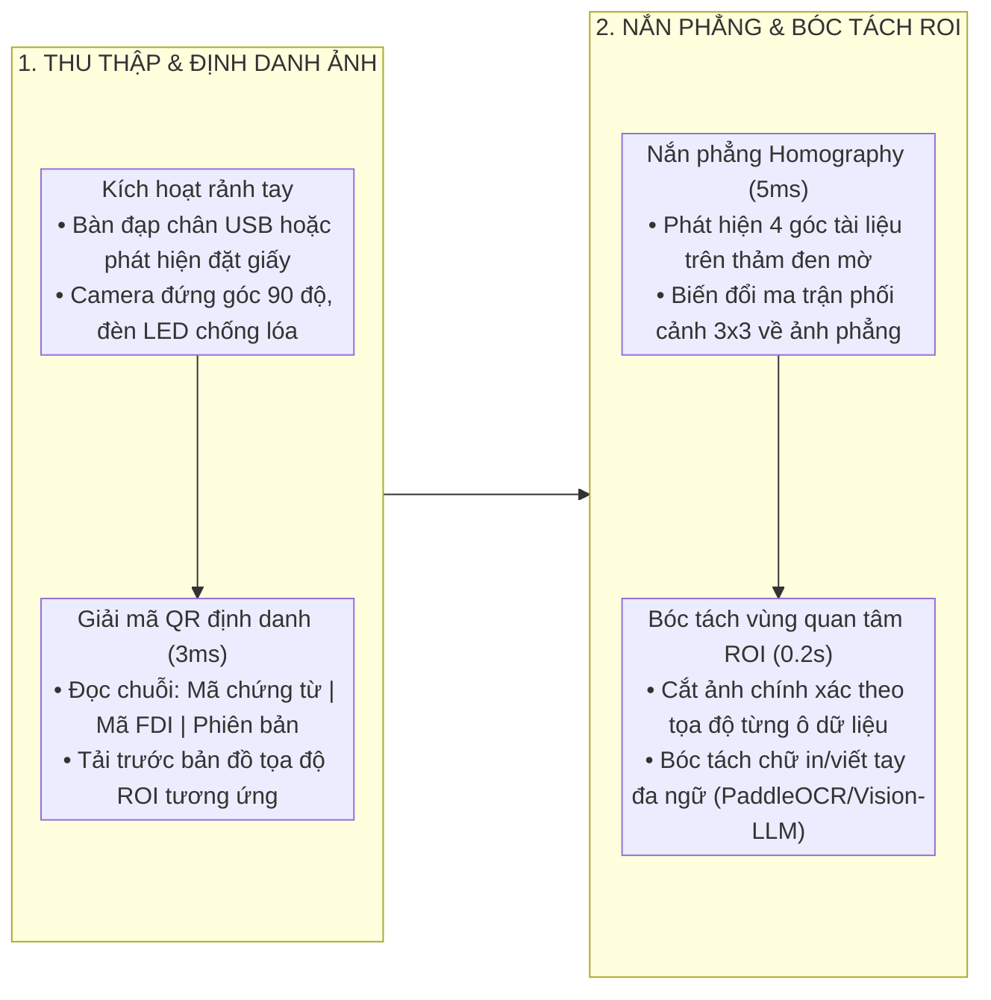

# QUY CHUẨN THỊ GIÁC MÁY TÍNH VÀ BÓC TÁCH BIỂU MẪU FDI (FDI VISION STATION)

Tài liệu này đặc tả quy chuẩn thiết kế, thuật toán và luồng xử lý cho phân hệ Thị giác máy tính và Trạm thu thập dữ liệu biểu mẫu rảnh tay FDI, kế thừa từ tài liệu nghiên cứu `docsbase/rd/fdi-form-ocr-station.md`.

---

## 1. LUỒNG XỬ LÝ 4 BƯỚC CHUẨN CÔNG NGHIỆP

---

## 2. QUY CHUẨN THUẬT TOÁN VÀ TỌA ĐỘ VÙNG ROI

### 2.1. Biến đổi phối cảnh Homography 4 góc
* Điểm tọa độ 4 góc gốc: `[(x0, y0), (x1, y1), (x2, y2), (x3, y3)]` (Góc trên-trái, trên-phải, dưới-phải, dưới-trái).
* Kích thước đầu ra chuẩn hóa: Khổ giấy A4 chuẩn tại độ phân giải làm việc (`1654 × 2338 px` ở 200 DPI hoặc `2480 × 3508 px` ở 300 DPI).
* Thời gian xử lý: Tối đa **5 mili-giây** trên CPU/GPU.

### 2.2. Chuẩn hóa bản đồ tọa độ ROI
Mỗi trường dữ liệu cần bóc tách trong biểu mẫu FDI được định nghĩa qua `RoiFieldDefinition`:
* `field_name`: Tên trường dữ liệu chuẩn hóa (ví dụ `actual_weight`, `delivery_date`, `driver_name`, `item_quantity`).
* `bbox`: Bộ tứ tọa độ chuẩn hóa tỉ lệ `[x_min, y_min, x_max, y_max]` trong khoảng `[0.0, 1.0]`.
* `data_type`: Kiểu dữ liệu (`STRING`, `INTEGER`, `DECIMAL`, `DATE`, `SIGNATURE`).
* `language`: Ngôn ngữ mục tiêu (`VI`, `EN`, `ZH`, `KO`, `JA`).

---

## 3. BÓC TÁCH HÓA ĐƠN VAT VÀ BẢNG DỰ TOÁN BOQ

* **Hóa đơn VAT điện tử:** Tự động trích xuất Mã số thuế người bán, Tên đơn vị bán, Số hóa đơn, Ngày lập, Danh sách mặt hàng, Tổng tiền trước thuế, Thuế suất VAT, Tổng tiền thanh toán.
* **Bảng dự toán BoQ:** Tự động phân tách cấu trúc bảng thành từng dòng công tác (`line_items`), bao gồm: Mã hiệu công tác, Nội dung công việc, Đơn vị tính, Khối lượng mời thầu, Đơn giá dự thầu, Thành tiền.
