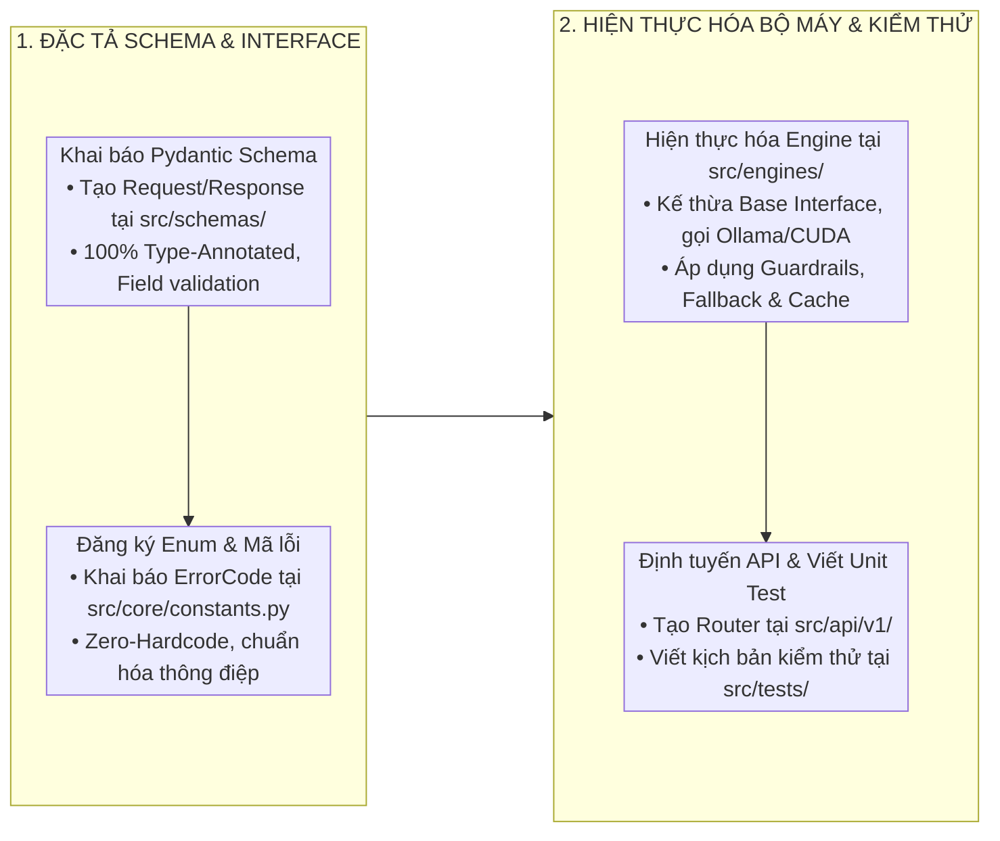

# KỸ NĂNG PHÁT TRIỂN VÀ MỞ RỘNG CÁC BỘ MÁY TRÍ TUỆ NHÂN TẠO (AI ENGINE DEVELOPER)

Kỹ năng này hướng dẫn quy trình tiêu chuẩn để phát triển, tích hợp và kiểm thử các thành phần AI trong dự án `miai`.

---

## 1. QUY TRÌNH PHÁT TRIỂN 4 BƯỚC



---

## 2. HƯỚNG DẪN MỞ RỘNG TỪNG BỘ MÁY

### 2.1. Thêm công cụ mới cho ReAct Autonomous Agent
1. Khai báo hàm công cụ trong `src/engines/agent/tools.py` sử dụng decorator `@ai_tool`:
   ```python
   @ai_tool(
       name="lookup_inventory_status",
       description="Tra cứu tồn kho thực tế của mặt hàng theo mã sản phẩm (SKU)."
   )
   async def lookup_inventory_status(sku: str) -> dict:
       # Xử lý logic nghiệp vụ
       return {"sku": sku, "in_stock": 150, "warehouse": "KHO_TONG_BAC_NINH"}
   ```
2. Đăng ký công cụ vào `ToolRegistry.register(lookup_inventory_status)`.
3. Viết Unit Test kiểm thử trong `src/tests/test_agent_tools.py`.

### 2.2. Thêm biểu mẫu FDI mới cho Vision Engine
1. Khai báo bản đồ tọa độ ROI trong `src/engines/vision/roi_extractor.py`.
2. Định nghĩa các trường dữ liệu mục tiêu kèm kiểu dữ liệu và ngôn ngữ (`VI`, `EN`, `ZH`, `KO`, `JA`).
3. Kiểm thử trích xuất bằng bài test trong `src/tests/test_vision_roi.py`.

### 2.3. Bổ sung nguồn dữ liệu Text-to-SQL
1. Cấu hình Data Dictionary của bảng dữ liệu trong `src/engines/text_to_sql/schema_inspector.py`.
2. Bảo đảm mọi truy vấn qua `AstValidator` đều chặn 100% các lệnh sửa đổi dữ liệu.
3. Chạy `uv run pytest src/tests/test_sql_sandbox.py` để nghiệm thu.
