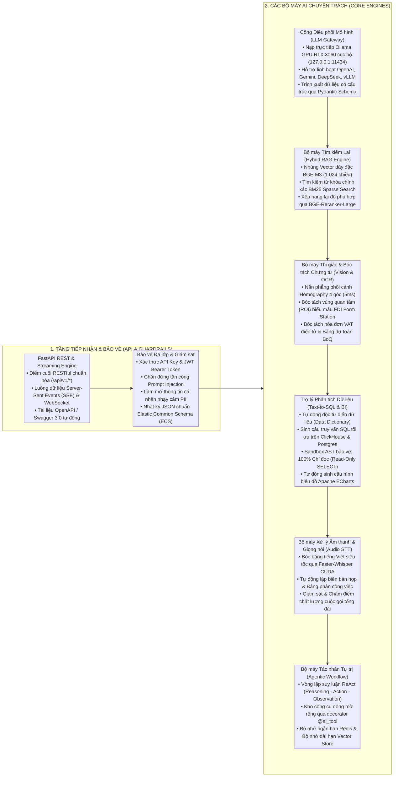

# NỀN TẢNG TRÍ TUỆ NHÂN TẠO CHUẨN MỰC DOANH NGHIỆP (ENTERPRISE GOLDEN STANDARD AI FOUNDATION — MIAI)

Bộ khung kiến trúc AI chuẩn mực được thiết kế và hiện thực hóa dựa trên cấu hình phần cứng tối ưu của máy chủ `micro-server` (GPU NVIDIA RTX 3060 12GB GDDR6, 32 luồng CPU Intel Xeon, 62GB RAM) và quy hoạch các phân hệ AI trọng tâm trong hệ sinh thái quản trị doanh nghiệp hiện đại (`chapi CRM`, `NexaFlow MES`, `Micro-ERP`).

---

## 1. TỔNG QUAN KIẾN TRÚC VÀ CÁC BỘ MÁY LÕI

Dự án `miai` được xây dựng trên nền tảng **Python 3.11+ / FastAPI** theo nguyên lý **Clean Architecture / Ports & Adapters**, tích hợp sẵn 6 bộ máy chuyên trách độc lập:



---

## 2. HỆ THỐNG TÀI LIỆU R&D CHUYÊN SÂU

Toàn bộ báo cáo nghiên cứu khả thi, khảo sát mô hình mã nguồn mở và thiết kế chi tiết các phân hệ AI được lưu trữ tại thư mục `doc/rd/`:

| Tài liệu phân hệ | Đường dẫn tệp | Mô hình AI & Công nghệ cốt lõi | Phạm vi giải pháp |
| :--- | :--- | :--- | :--- |
| **Bóc tách Văn bản & Thị giác** | [`doc/rd/ocr.md`](file:///Users/micro/Source/miai/doc/rd/ocr.md) | `Qwen2.5-VL 7B` + OpenCV Homography | Nhận diện chữ in & chữ viết tay, Hóa đơn VAT, Bảng BoQ, CCCD/Hộ chiếu, Biểu mẫu FDI hiện trường. |
| **Trợ lý Chat CRM Tạo Đơn Nhanh** | [`doc/rd/chat.md`](file:///Users/micro/Source/miai/doc/rd/chat.md) | `Qwen2.5-7B` + `instructor` + `langgraph` | Đọc hiểu câu lệnh tiếng Việt viết tắt của nhân viên bán hàng, gọi Tool CSDL CRM, tự học thích ứng Few-Shot RAG. |
| **AI Query & Báo cáo Động No-Code** | [`doc/rd/sql_report.md`](file:///Users/micro/Source/miai/doc/rd/sql_report.md) | `Qwen2.5-Coder-7B` + `sqlglot` + `echarts` | Zero-Config DB Introspection, Schema Pruning RAG, AST Sandbox cô lập đa người thuê, sinh biểu đồ ECharts 1 chạm. |

---

## 3. CẤU TRÚC THƯ MỤC DỰ ÁN

```text
miai/
├── doc/                                 # KHO TÀI LIỆU NGHIÊN CỨU & THIẾT KẾ R&D
│   └── rd/
│       ├── ocr.md                       # Nghiên cứu bóc tách thị giác VLM (Qwen2.5-VL)
│       ├── chat.md                      # Thiết kế Trợ lý Chat CRM tạo đơn hàng nhanh
│       └── sql_report.md                # Thiết kế AI Query & Báo cáo Động No-Code
│
├── README.md                            # Tài liệu kiến trúc và hướng dẫn vận hành
├── pyproject.toml                       # Quản lý gói phụ thuộc theo chuẩn PEP 621 (uv)
├── requirements.txt                     # Danh mục thư viện Python 3.11+
├── Dockerfile                           # Đóng gói Container tối ưu hóa GPU CUDA và CPU fallback
├── docker-compose.yml                   # Khởi chạy cụm miai + pgvector + Redis
├── .env.example                         # Biến môi trường mẫu
├── .env                                 # Biến môi trường thực thi cục bộ
├── main.py                              # FastAPI Application Entrypoint
│
├── core/                                # TẦNG NỀN TẢNG DÙNG CHUNG (CORE FOUNDATION)
│   ├── __init__.py
│   ├── config.py                        # Pydantic BaseSettings quản lý cấu hình tập trung
│   ├── constants.py                     # 100% Enums: ModelProvider, TaskType, ErrorCode, AgentState...
│   ├── exceptions.py                    # Hệ thống ngoại lệ phân cấp (MIAIException, LLMException...)
│   ├── responses.py                     # ApiResponse chuẩn hóa đồng bộ toàn hệ sinh thái
│   ├── security.py                      # API Key, JWT Header Verification, TenantContext
│   ├── guardrails.py                    # Khử Prompt Injection, làm mờ thông tin PII nhạy cảm
│   ├── telemetry.py                     # Prometheus Metrics, OpenTelemetry Tracing, JSON ECS Logging
│   └── database.py                      # Async SQLAlchemy 2.0 Engine kết nối PostgreSQL pgvector & Redis
│
├── schemas/                             # LƯỢC ĐỒ DỮ LIỆU PYDANTIC V2 (SCHEMAS & DTOs)
│   ├── __init__.py
│   ├── chat.py                          # ChatRequest, ChatResponse, StreamChunk
│   ├── rag.py                           # DocumentCreate, SearchQuery, SearchResult, RAGResponse
│   ├── vision.py                        # OcrRequest, IdentityDto, InvoiceDto, BoqTableDto, FdiFormDto
│   ├── analytics.py                     # TextToSqlRequest, SqlQueryResult, ChartDataResponse
│   ├── audio.py                         # AudioTranscribeRequest, MeetingMinutesDto, CallScoreDto
│   └── agent.py                         # AgentRunRequest, AgentStepDto, AgentRunResponse
│
├── engines/                             # CÁC BỘ MÁY AI CHUYÊN TRÁCH ĐỘC LẬP
│   ├── __init__.py
│   ├── llm/                             # BỘ MÁY ĐIỀU PHỐI MÔ HÌNH NGÔN NGỮ (LLM GATEWAY)
│   │   ├── base.py                      # Abstract Base LLM Provider Interface
│   │   ├── factory.py                   # LLM Factory (Ollama, OpenAI, Gemini, Anthropic, DeepSeek)
│   │   ├── ollama_provider.py           # Provider kết nối Ollama GPU RTX 3060 nội bộ
│   │   ├── openai_provider.py           # Provider kết nối OpenAI API
│   │   ├── gemini_provider.py           # Provider kết nối Google Gemini API
│   │   ├── streaming.py                 # Async SSE Token Streamer & WebSocket Helper
│   │   └── structured.py                # Trích xuất dữ liệu có cấu trúc Pydantic Schema
│   │
│   ├── rag/                             # BỘ MÁY TÌM KIẾM LAI VÀ TRI THỨC (HYBRID RAG)
│   │   ├── chunker.py                   # Semantic & Recursive Token Document Splitter
│   │   ├── embeddings.py                # BGE-M3 Dense Vector Generator (Ollama / Local / API)
│   │   ├── bm25_retriever.py            # Sparse Keyword Search BM25
│   │   ├── reranker.py                  # Cross-Encoder Reranker (BGE-Reranker-Large)
│   │   ├── vector_store.py              # PgVectorStore, InMemoryVectorStore
│   │   └── pipeline.py                  # Complete Hybrid Retrieval & Fusion Ranking Pipeline
│   │
│   ├── vision/                          # BỘ MÁY THỊ GIÁC VÀ BÓC TÁCH CHỨNG TỪ (VISION)
│   │   ├── ocr_reader.py                # Qwen2.5-VL Adapter / Vision LLM
│   │   ├── homography.py                # Nắn phẳng phối cảnh Homography & Căn chỉnh 4 góc (5ms)
│   │   ├── roi_extractor.py             # Bóc tách vùng quan tâm theo tọa độ mẫu FDI Form
│   │   ├── identity_parser.py           # Parser chuyên dụng CCCD, Hộ chiếu, GPLX
│   │   ├── invoice_parser.py            # Parser chuyên dụng Hóa đơn VAT điện tử & Phiếu cân
│   │   └── boq_parser.py                # Parser chuyên dụng Bảng BoQ dự toán đấu thầu
│   │
│   ├── text_to_sql/                     # BỘ MÁY TRỢ LÝ TRUY VẤN DỮ LIỆU & BI (TEXT-TO-SQL)
│   │   ├── schema_inspector.py          # Tự động đọc và lập chỉ mục Schema CSDL (Zero-Lock)
│   │   ├── query_generator.py           # Sinh câu truy vấn SQL có kiểm soát ngữ cảnh (Qwen2.5-Coder)
│   │   ├── ast_validator.py             # Sandbox AST SQLGlot (100% Read-Only SELECT & Tenant Injection)
│   │   ├── executor.py                  # Thực thi truy vấn an toàn với Timeout & Row Limit
│   │   └── chart_formatter.py           # Tự động sinh cấu hình biểu đồ Apache ECharts
│   │
│   ├── audio/                           # BỘ MÁY XỬ LÝ ÂM THANH & TỔNG ĐÀI (AUDIO)
│   │   ├── whisper_stt.py               # Faster-Whisper GPU/CPU Speech-to-Text Driver
│   │   ├── meeting_summarizer.py        # Tóm tắt biên bản họp & Bóc tách Action Items
│   │   └── call_center_evaluator.py     # Chấm điểm chất lượng cuộc gọi & Cảm xúc khách hàng
│   │
│   └── agent/                           # BỘ MÁY TÁC NHÂN TỰ TRỊ & TOOL CALLING (AGENT)
│       ├── state.py                     # Agent State & Memory Container
│       ├── tools.py                     # Tool Registry & Decorator (@ai_tool)
│       ├── memory.py                    # Short-term Redis Memory & Long-term Vector Memory
│       └── react_graph.py               # Vòng lặp suy luận ReAct (Reasoning - Action - Observation)
│
├── api/                                 # TẦNG GIAO TIẾP VÀ ĐỊNH TUYẾN (API INTERFACE)
│   ├── dependencies.py                  # FastAPI Dependencies (Auth, DB, Redis, Pipelines)
│   └── v1/
│       ├── router.py                    # Master API Router v1
│       ├── chat.py                      # Endpoints Chat completion, Streaming SSE
│       ├── rag.py                       # Endpoints Ingestion, Hybrid Search, RAG QA
│       ├── vision.py                    # Endpoints OCR, Biểu mẫu FDI, Hóa đơn VAT, BoQ, CCCD
│       ├── analytics.py                 # Endpoints Text-to-SQL, Báo cáo biểu đồ
│       ├── audio.py                     # Endpoints Biên bản họp, Chấm điểm cuộc gọi
│       └── agent.py                     # Endpoints Khởi chạy Agentic Workflow & ReAct Loop
│
└── tests/                               # BỘ KIỂM THỬ TỰ ĐỘNG (AUTOMATED TEST SUITE)
    ├── conftest.py
    ├── test_llm_gateway.py
    ├── test_hybrid_rag.py
    ├── test_vision_roi.py
    ├── test_sql_sandbox.py
    └── test_agent_tools.py
```

---

## 4. CÁC TÍNH NĂNG VÀ MẪU THIẾT KẾ ĐẶC QUYỀN

1. **Kiến trúc Nhà cung cấp Đa dạng (Multi-Provider Model Agnostic):**
   * Mặc định kết nối tới **Ollama Engine cục bộ chạy trên GPU NVIDIA RTX 3060 12GB VRAM** (`http://127.0.0.1:11434`), tận dụng tối đa tốc độ suy luận **45 – 65 tokens/giây** với độ trễ tối thiểu (TTFT < 0.2s).
   * Tự động chuyển đổi mượt mà sang các dịch vụ đám mây (OpenAI, Gemini, DeepSeek, vLLM) chỉ bằng cấu hình biến môi trường hoặc tham số yêu cầu API.
2. **Bộ máy Tìm kiếm Lai Đa Tầng (Hybrid Retrieval & Fusion Reranking):**
   * Kết hợp sức mạnh hiểu sâu ngữ nghĩa của **Vector dày đặc BGE-M3 (1.024 chiều)** với khả năng khớp chính xác 100% mã SKU, số Seri, mã số thuế của **Thuật toán BM25 Sparse Search**.
   * Bộ lọc xếp hạng lại **BGE-Reranker-Large** tái sắp xếp kết quả giúp độ chính xác đạt mức cao nhất trước khi đưa vào ngữ cảnh LLM.
3. **Môi trường Thực thi An toàn Sandbox cho Text-to-SQL:**
   * Sử dụng bộ phân tích cú pháp cây cú pháp trừu tượng (AST Parser qua `sqlglot`) để kiểm tra nghiêm ngặt: **Chặn 100% các câu lệnh DDL/DML thay đổi dữ liệu** (`INSERT`, `UPDATE`, `DELETE`, `DROP`, `ALTER`, `TRUNCATE`), triệt tiêu hoàn toàn rủi ro phá hoại CSDL hoặc SQL Injection.
   * Tự động tiêm điều kiện `tenant_id` cách ly dữ liệu doanh nghiệp và sinh cấu hình biểu đồ Apache ECharts trực quan.
4. **Giải pháp Bóc tách Biểu mẫu Hiện trường FDI (FDI Form ROI Station):**
   * Thuật toán nắn phẳng phối cảnh **Homography Transformation** tự động căn chỉnh góc nghiêng trong 5ms.
   * Cắt chính xác các vùng quan tâm (ROI) dựa trên bản đồ tọa độ mẫu biểu, giảm 85% diện tích xử lý và đẩy tốc độ hoàn tất một chứng từ xuống chỉ còn **0.1 – 0.2 giây/phiếu**.
5. **Bộ máy Tác nhân Tự trị & Bộ nhớ Phân tán (ReAct Agent & Memory):**
   * Vòng lặp suy luận ReAct từng bước có kiểm soát, hỗ trợ đăng ký công cụ nghiệp vụ linh hoạt thông qua decorator `@ai_tool`.
   * Quản lý bộ nhớ ngắn hạn của phiên trên Redis và bộ nhớ dài hạn trên Vector Store.

---

## 5. HƯỚNG DẪN KHỞI CHẠY VÀ KIỂM THỬ

### Bước 1: Khởi động Hạ tầng Hỗ trợ (Docker Compose)
```bash
cd src
docker-compose up -d postgres-vector redis-cache
```

### Bước 2: Cài đặt Gói Phụ thuộc và Khởi chạy Ứng dụng
```bash
# Đồng bộ môi trường ảo và phụ thuộc với uv
uv sync

# Hoặc cài đặt qua pip
pip install -r requirements.txt

# Khởi chạy máy chủ phát triển
uv run uvicorn main:app --host 0.0.0.0 --port 8000 --reload
```

### Bước 3: Chạy Toàn Bộ Bộ Kiểm Thử Tự Động
```bash
uv run pytest -v
```

### Bước 4: Điểm cuối API và Cổng Dịch vụ Mạng
* **Production Gateway:** `https://miai.microtec.vn`
* **Swagger UI OpenAPI 3.0:** `https://miai.microtec.vn/docs` (Cục bộ: `http://localhost:8000/docs`)
* **Redoc UI:** `https://miai.microtec.vn/redoc` (Cục bộ: `http://localhost:8000/redoc`)
* **Kiểm tra Sức khỏe Hệ thống:** `https://miai.microtec.vn/health` (Cục bộ: `http://localhost:8000/health`)
* **Chỉ số Giám sát Prometheus APM:** `https://miai.microtec.vn/metrics` (Cục bộ: `http://localhost:8000/metrics`)
