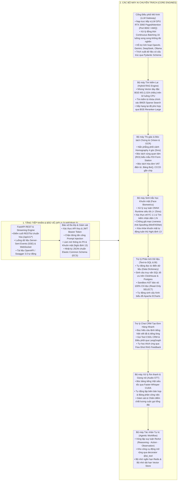

# NỀN TẢNG TRÍ TUỆ NHÂN TẠO CHUẨN MỰC DOANH NGHIỆP (ENTERPRISE GOLDEN STANDARD AI FOUNDATION — MIAI)

Bộ khung kiến trúc AI chuẩn mực được thiết kế và hiện thực hóa dựa trên cấu hình phần cứng tối ưu của máy chủ `micro-server` (GPU NVIDIA GeForce RTX 3060 12GB GDDR6, 32 luồng CPU Intel Xeon, 62GB RAM) và quy hoạch 8 nhóm sản phẩm AI trọng tâm trong hệ sinh thái quản trị doanh nghiệp hiện đại (`chapi CRM`, `NexaFlow MES`, `Micro-ERP`, `Micro-Report`, `Natcash`).

---

## 1. TỔNG QUAN KIẾN TRÚC VÀ CÁC BỘ MÁY LÕI

Dự án `miai` được xây dựng trên nền tảng **Python 3.11+ / FastAPI** theo nguyên lý **Clean Architecture / Ports & Adapters**, tích hợp sẵn 8 bộ máy chuyên trách độc lập:


```mermaid
%%{init: {'flowchart': {'nodeSpacing': 8, 'rankSpacing': 140, 'padding': 3, 'curve': 'basis'}}}%%
flowchart LR
    subgraph S_API_GATEWAY ["1. TẦNG TIẾP NHẬN & BẢO VỆ (API & GUARDRAILS)"]
        direction TB
        FASTAPI_CORE["FastAPI REST & Streaming Engine<br/>• Điểm cuối RESTful chuẩn hóa (/api/v1/*)<br/>• Luồng dữ liệu Server-Sent Events (SSE) & WebSocket<br/>• Tài liệu OpenAPI / Swagger 3.0 tự động"]
        SECURITY_SHIELD["Bảo vệ Đa lớp & Giám sát<br/>• Xác thực API Key & JWT Bearer Token<br/>• Chặn đứng tấn công Prompt Injection<br/>• Làm mờ thông tin PII & Khuôn mặt (Nghị định 13)<br/>• Nhật ký JSON chuẩn Elastic Common Schema (ECS)"]
        FASTAPI_CORE --> SECURITY_SHIELD
    end

    subgraph S_CORE_ENGINES ["2. CÁC BỘ MÁY AI CHUYÊN TRÁCH (CORE ENGINES)"]
        direction TB
        ENG_LLM["Cổng Điều phối Mô hình (LLM Gateway)<br/>• Nạp trực tiếp vLLM GPU RTX 3060 PagedAttention (Port 8002 / AWQ)<br/>• Xử lý đồng thời Continuous Batching 16 luồng song song không đơ nghẽn<br/>• Hỗ trợ linh hoạt OpenAI, Gemini, DeepSeek, Ollama<br/>• Trích xuất dữ liệu có cấu trúc qua Pydantic Schema"]
        ENG_RAG["Bộ máy Tìm kiếm Lai (Hybrid RAG Engine)<br/>• Nhúng Vector dày đặc BGE-M3 (1.024 chiều) trên 32 luồng CPU<br/>• Tìm kiếm từ khóa chính xác BM25 Sparse Search<br/>• Xếp hạng lại độ phù hợp qua BGE-Reranker-Large"]
        ENG_VISION["Bộ máy Thị giác & Bóc tách Chứng từ (Vision & OCR)<br/>• Nắn phẳng phối cảnh Homography 4 góc (5ms)<br/>• Bóc tách vùng quan tâm (ROI) biểu mẫu FDI Form Station<br/>• Bóc tách hóa đơn VAT điện tử, Bảng BoQ, CCCD gắn chip"]
        ENG_FACE["Bộ máy Sinh trắc học Khuôn mặt (Face Biometrics)<br/>• Xử lý suy luận ONNX Runtime siêu tốc (< 25ms)<br/>• Xác thực eKYC 1:1 & Tìm kiếm nhận diện 1:N<br/>• Chống giả mạo Liveness Anti-Spoofing (MiniFASNet)<br/>• Xóa nhòe khuôn mặt tự động tuân thủ Nghị định 13"]
        ENG_SQL["Trợ lý Phân tích Dữ liệu (Text-to-SQL & BI)<br/>• Tự động đọc từ điển dữ liệu (Data Dictionary)<br/>• Sinh câu truy vấn SQL tối ưu trên ClickHouse & Postgres<br/>• Sandbox AST bảo vệ: 100% Chỉ đọc (Read-Only SELECT)<br/>• Tự động sinh cấu hình biểu đồ Apache ECharts"]
        ENG_CRM["Trợ lý Chat CRM Tạo Đơn Hàng Nhanh<br/>• Đọc hiểu câu lệnh tiếng Việt viết tắt & tiếng lóng<br/>• Gọi Tool CSDL CRM & Điều phối qua LangGraph<br/>• Tự học thích ứng qua Few-Shot RAG Feedback"]
        ENG_AUDIO["Bộ máy Xử lý Âm thanh & Giọng nói (Audio STT)<br/>• Bóc băng tiếng Việt siêu tốc qua Faster-Whisper CUDA<br/>• Tự động lập biên bản họp & Bảng phân công việc<br/>• Giám sát & Chấm điểm chất lượng cuộc gọi tổng đài"]
        ENG_AGENT["Bộ máy Tác nhân Tự trị (Agentic Workflow)<br/>• Vòng lặp suy luận ReAct (Reasoning - Action - Observation)<br/>• Kho công cụ động mở rộng qua decorator @ai_tool<br/>• Bộ nhớ ngắn hạn Redis & Bộ nhớ dài hạn Vector Store"]
        ENG_LLM --> ENG_RAG
        ENG_RAG --> ENG_VISION
        ENG_VISION --> ENG_FACE
        ENG_FACE --> ENG_SQL
        ENG_SQL --> ENG_CRM
        ENG_CRM --> ENG_AUDIO
        ENG_AUDIO --> ENG_AGENT
    end

    SECURITY_SHIELD --> S_CORE_ENGINES
```

---

## 2. HỆ THỐNG TÀI LIỆU R&D CHUYÊN SÂU

Toàn bộ báo cáo nghiên cứu khả thi, khảo sát mô hình mã nguồn mở và thiết kế chi tiết các phân hệ AI được lưu trữ tại thư mục `doc/rd/`:

| Tài liệu phân hệ | Đường dẫn tệp | Mô hình AI & Công nghệ cốt lõi | Phạm vi giải pháp |
| :--- | :--- | :--- | :--- |
| **Bóc tách Văn bản & Thị giác** | [`doc/rd/ocr.md`](file:///Users/micro/Source/miai/doc/rd/ocr.md) | `Qwen2.5-VL 7B` + OpenCV Homography | Nhận diện chữ in & chữ viết tay, Hóa đơn VAT, Bảng BoQ, CCCD/Hộ chiếu, Biểu mẫu FDI hiện trường. |
| **Trợ lý Chat CRM Tạo Đơn Nhanh** | [`doc/rd/chat.md`](file:///Users/micro/Source/miai/doc/rd/chat.md) | `Qwen2.5-7B` + `instructor` + `langgraph` | Đọc hiểu câu lệnh tiếng Việt viết tắt của nhân viên bán hàng, gọi Tool CSDL CRM, tự học thích ứng Few-Shot RAG. |
| **AI Query & Báo cáo Động No-Code** | [`doc/rd/sql_report.md`](file:///Users/micro/Source/miai/doc/rd/sql_report.md) | `Qwen2.5-Coder-7B` + `sqlglot` + `echarts` | Zero-Config DB Introspection, Schema Pruning RAG, AST Sandbox cô lập đa người thuê, sinh biểu đồ ECharts 1 chạm. |

---

## 3. CẤU TRÚC THƯ MỤC DỰ ÁN

```text
miai/
├── doc/                                 # KHO TÀI LIỆU NGHIÊN CỨU & THIẾT KẾ R&D
│   └── rd/
│       ├── ocr.md                       # Nghiên cứu bóc tách thị giác VLM (Qwen2.5-VL)
│       ├── chat.md                      # Thiết kế Trợ lý Chat CRM tạo đơn hàng nhanh
│       └── sql_report.md                # Thiết kế AI Query & Báo cáo Động No-Code
│
├── README.md                            # Tài liệu kiến trúc và hướng dẫn vận hành
├── pyproject.toml                       # Quản lý gói phụ thuộc theo chuẩn PEP 621 (uv)
├── requirements.txt                     # Danh mục thư viện Python 3.11+
├── Dockerfile                           # Đóng gói Container tối ưu hóa GPU CUDA và CPU fallback
├── docker-compose.yml                   # Khởi chạy cụm miai + vLLM AWQ + pgvector + Redis
├── .env.example                         # Biến môi trường mẫu
├── .env                                 # Biến môi trường thực thi cục bộ
├── main.py                              # FastAPI Application Entrypoint
│
├── core/                                # TẦNG NỀN TẢNG DÙNG CHUNG (CORE FOUNDATION)
│   ├── __init__.py
│   ├── config.py                        # Pydantic BaseSettings quản lý cấu hình tập trung (vLLM mặc định)
│   ├── constants.py                     # 100% Enums: ModelProvider, TaskType, ErrorCode, FaceDetectorType...
│   ├── exceptions.py                    # Hệ thống ngoại lệ phân cấp (BaseAIException, FaceBiometricsException...)
│   ├── responses.py                     # ApiResponse chuẩn hóa đồng bộ toàn hệ sinh thái
│   ├── security.py                      # API Key, JWT Header Verification, TenantContext
│   ├── guardrails.py                    # Khử Prompt Injection, làm mờ thông tin PII & khuôn mặt (Nghị định 13)
│   ├── telemetry.py                     # Prometheus Metrics, OpenTelemetry Tracing, JSON ECS Logging
│   └── database.py                      # Async SQLAlchemy 2.0 Engine kết nối PostgreSQL pgvector & Redis
│
├── schemas/                             # LƯỢC ĐỒ DỮ LIỆU PYDANTIC V2 (SCHEMAS & DTOs)
│   ├── __init__.py
│   ├── chat.py                          # ChatRequest, ChatResponse, StreamChunk
│   ├── rag.py                           # DocumentCreate, SearchQuery, SearchResult, RAGResponse
│   ├── vision.py                        # OcrRequest, InvoiceDto, BoqTableDto, FdiFormDto, IdentityCardRequest
│   ├── face.py                          # FaceDetectRequest/Response, FaceCompareRequest, FaceSearchRequest...
│   ├── analytics.py                     # TextToSqlRequest, SqlQueryResult, ChartDataResponse
│   ├── audio.py                         # AudioTranscribeRequest, MeetingMinutesDto, CallScoreDto
│   ├── agent.py                         # AgentRunRequest, AgentStepDto, AgentRunResponse
│   └── chat_crm.py                      # ChatOrderRequest, ChatOrderResponse, OrderItemDto, CustomerDto
│
├── engines/                             # CÁC BỘ MÁY AI CHUYÊN TRÁCH ĐỘC LẬP
│   ├── __init__.py
│   ├── llm/                             # BỘ MÁY ĐIỀU PHỐI MÔ HÌNH NGÔN NGỮ (LLM GATEWAY)
│   │   ├── base.py                      # Abstract Base LLM Provider Interface
│   │   ├── factory.py                   # LLM Factory (vLLM mặc định, Ollama, OpenAI, Gemini, DeepSeek)
│   │   ├── vllm_provider.py             # Provider vLLM PagedAttention & Continuous Batching tốc độ cao
│   │   ├── ollama_provider.py           # Provider kết nối Ollama GPU nội bộ (dự phòng/fallback)
│   │   ├── openai_provider.py           # Provider kết nối OpenAI API
│   │   ├── gemini_provider.py           # Provider kết nối Google Gemini API
│   │   ├── streaming.py                 # Async SSE Token Streamer & WebSocket Helper
│   │   └── structured.py                # Trích xuất dữ liệu có cấu trúc Pydantic Schema
│   │
│   ├── rag/                             # BỘ MÁY TÌM KIẾM LAI VÀ TRI THỨC (HYBRID RAG)
│   │   ├── chunker.py                   # Semantic & Recursive Token Document Splitter
│   │   ├── embeddings.py                # BGE-M3 Dense Vector Generator (Deterministic CPU / pgvector)
│   │   ├── bm25_retriever.py            # Sparse Keyword Search BM25
│   │   ├── reranker.py                  # Cross-Encoder Reranker (BGE-Reranker-Large)
│   │   ├── vector_store.py              # PgVectorStore, InMemoryVectorStore
│   │   └── pipeline.py                  # Complete Hybrid Retrieval & Fusion Ranking Pipeline
│   │
│   ├── vision/                          # BỘ MÁY THỊ GIÁC VÀ BÓC TÁCH CHỨNG TỪ (VISION)
│   │   ├── ocr_reader.py                # Vision LLM Adapter / OCR Reader
│   │   ├── homography.py                # Nắn phẳng phối cảnh Homography & Căn chỉnh 4 góc (5ms)
│   │   ├── roi_extractor.py             # Bóc tách vùng quan tâm theo tọa độ mẫu FDI Form
│   │   ├── identity_parser.py           # Parser chuyên dụng CCCD gắn chip, Hộ chiếu, GPLX
│   │   ├── invoice_parser.py            # Parser chuyên dụng Hóa đơn VAT điện tử & Phiếu cân
│   │   └── boq_parser.py                # Parser chuyên dụng Bảng BoQ dự toán đấu thầu
│   │
│   ├── face/                            # BỘ MÁY SINH TRẮC HỌC KHUÔN MẶT (FACE BIOMETRICS)
│   │   ├── detector.py                  # Phát hiện khuôn mặt & 5 điểm mốc (SCRFD, RetinaFace)
│   │   ├── recognizer.py                # Trích xuất vector đặc trưng 512-dim (AdaFace, ArcFace)
│   │   ├── liveness.py                  # Chống giả mạo ảnh/màn hình Anti-Spoofing (MiniFASNet)
│   │   ├── quality.py                   # Chấm điểm chất lượng ảnh khuôn mặt (eDifFIQA)
│   │   ├── anonymizer.py                # Làm mờ khuôn mặt tự động tuân thủ Nghị định 13
│   │   ├── vector_matcher.py            # So khớp Cosine Similarity 1:1 và Tìm kiếm 1:N
│   │   └── pipeline.py                  # FaceBiometricsPipeline tích hợp chuẩn hóa
│   │
│   ├── text_to_sql/                     # BỘ MÁY TRỢ LÝ TRUY VẤN DỮ LIỆU & BI (TEXT-TO-SQL)
│   │   ├── schema_inspector.py          # Tự động đọc và lập chỉ mục Schema CSDL (Zero-Lock)
│   │   ├── query_generator.py           # Sinh câu truy vấn SQL (Qwen2.5-Coder qua vLLM)
│   │   ├── ast_validator.py             # Sandbox AST SQLGlot (100% Read-Only SELECT & Tenant Injection)
│   │   ├── executor.py                  # Thực thi truy vấn an toàn với Timeout & Row Limit
│   │   └── chart_formatter.py           # Tự động sinh cấu hình biểu đồ Apache ECharts
│   │
│   ├── chat_crm/                        # BỘ MÁY TRỢ LÝ CHAT CRM TẠO ĐƠN HÀNG NHANH
│   │   ├── nlu_preprocessor.py          # Chuẩn hóa chính tả tiếng Việt & Giải mã từ viết tắt
│   │   ├── crm_tools.py                 # Bộ công cụ tra cứu Khách hàng, Sản phẩm, Tồn kho
│   │   ├── conversation_graph.py        # LangGraph State Graph điều phối hội thoại đa lượt
│   │   ├── structured_extractor.py      # Trích xuất thông tin đơn hàng nháp (DraftOrderSchema)
│   │   └── feedback_learner.py          # Tự học thích ứng qua phản hồi sửa sai của người dùng
│   │
│   ├── audio/                           # BỘ MÁY XỬ LÝ ÂM THANH & TỔNG ĐÀI (AUDIO)
│   │   ├── whisper_stt.py               # Faster-Whisper GPU/CPU Speech-to-Text Driver
│   │   ├── meeting_summarizer.py        # Tóm tắt biên bản họp & Bóc tách Action Items
│   │   └── call_center_evaluator.py     # Chấm điểm chất lượng cuộc gọi & Cảm xúc khách hàng
│   │
│   └── agent/                           # BỘ MÁY TÁC NHÂN TỰ TRỊ & TOOL CALLING (AGENT)
│       ├── state.py                     # Agent State & Memory Container
│       ├── tools.py                     # Tool Registry & Decorator (@ai_tool)
│       ├── memory.py                    # Short-term Redis Memory & Long-term Vector Memory
│       └── react_graph.py               # Vòng lặp suy luận ReAct (Reasoning - Action - Observation)
│
├── api/                                 # TẦNG GIAO TIẾP VÀ ĐỊNH TUYẾN (API INTERFACE)
│   ├── dependencies.py                  # FastAPI Dependencies (Auth, DB, Redis, Pipelines)
│   └── v1/
│       ├── router.py                    # Master API Router v1
│       ├── chat.py                      # Endpoints Chat completion, Streaming SSE
│       ├── rag.py                       # Endpoints Ingestion, Hybrid Search, RAG QA
│       ├── vision.py                    # Endpoints OCR, Biểu mẫu FDI, Hóa đơn VAT, BoQ, CCCD
│       ├── face.py                      # Endpoints Nhận diện, So khớp 1:1, Liveness, Xóa nhòe
│       ├── analytics.py                 # Endpoints Text-to-SQL, Báo cáo biểu đồ
│       ├── chat_crm.py                  # Endpoints Trợ lý Chat CRM tạo đơn hàng nhanh
│       ├── audio.py                     # Endpoints Biên bản họp, Chấm điểm cuộc gọi
│       └── agent.py                     # Endpoints Khởi chạy Agentic Workflow & ReAct Loop
│
└── tests/                               # BỘ KIỂM THỬ TỰ ĐỘNG (AUTOMATED TEST SUITE — 64 PASS)
    ├── conftest.py
    ├── test_vllm_provider.py            # Đo kiểm kết nối vLLM Provider, Streaming & Schema
    ├── test_face_engine.py              # Đo kiểm phát hiện, so khớp, liveness và anonymize khuôn mặt
    ├── test_llm_gateway.py              # Đo kiểm Guardrails, Prompt Injection & PII
    ├── test_hybrid_rag.py               # Đo kiểm BM25, Vector Search & Reranker
    ├── test_vision_roi.py               # Đo kiểm nắn phẳng Homography và ROI FDI
    ├── test_vision_parsers.py           # Đo kiểm trích xuất Hóa đơn VAT, BoQ và CCCD
    ├── test_sql_sandbox.py              # Đo kiểm Sandbox AST chặn lệnh DDL/DML và tiêm tenant_id
    ├── test_chat_crm.py                 # Đo kiểm NLU tiếng Việt, CRM Tools và State Graph
    └── test_agent_tools.py              # Đo kiểm ReAct Loop, Tool Registry và decorator @ai_tool
```

---

## 4. CÁC TÍNH NĂNG VÀ MẪU THIẾT KẾ ĐẶC QUYỀN

1. **Hạ tầng Phục vụ vLLM Tốc độ cao (vLLM PagedAttention AWQ):**
   * Mặc định kết nối tới **vLLM Engine chạy trên GPU NVIDIA RTX 3060 12GB VRAM** (`http://127.0.0.1:8002` hoặc nội bộ container `http://vllm-engine:8000/v1`).
   * Sử dụng mô hình lượng tử hóa **AWQ 4-bit (`Qwen/Qwen2.5-7B-Instruct-AWQ`)**, kích hoạt cơ chế **Continuous Batching** xử lý đồng thời 16 luồng song song với độ trễ token đầu tiên (TTFT) cực thấp.
   * Tự động chuyển đổi linh hoạt sang các nhà cung cấp khác (OpenAI, Gemini, DeepSeek, Ollama) theo tham số gọi API.
2. **Bộ máy Sinh trắc học Khuôn mặt Toàn diện (UniFace Biometrics Engine):**
   * Tối ưu hóa suy luận trên **32 luồng CPU Intel Xeon qua ONNX Runtime (< 25ms)**, bảo toàn 100% tài nguyên GPU cho vLLM.
   * Tích hợp đầy đủ: Phát hiện khuôn mặt và 5 điểm mốc (SCRFD), trích xuất vector đặc trưng 512 chiều (AdaFace), chống giả mạo màn hình/ảnh in (MiniFASNet), chấm điểm chất lượng (eDifFIQA) và xóa nhòe khuôn mặt tự động tuân thủ Nghị định 13/2023/NĐ-CP.
3. **Bộ máy Tìm kiếm Lai Đa Tầng (Hybrid Retrieval & Fusion Reranking):**
   * Bộ tạo vector xác định chạy trên CPU (1.024 chiều chuẩn BGE-M3) lưu trữ trên PostgreSQL pgvector.
   * Kết hợp tìm kiếm từ khóa chính xác BM25 Sparse Search và bộ lọc xếp hạng lại BGE-Reranker-Large.
4. **Môi trường Thực thi An toàn Sandbox cho Text-to-SQL:**
   * Sử dụng bộ phân tích cú pháp cây cú pháp trừu tượng AST qua `sqlglot`: **Chặn 100% các câu lệnh DDL/DML thay đổi dữ liệu** (`INSERT`, `UPDATE`, `DELETE`, `DROP`, `ALTER`, `TRUNCATE`).
   * Tự động tiêm điều kiện `tenant_id` cách ly dữ liệu doanh nghiệp và sinh cấu hình biểu đồ Apache ECharts trực quan.
5. **Giải pháp Bóc tách Biểu mẫu Hiện trường FDI (FDI Form ROI Station):**
   * Thuật toán nắn phẳng phối cảnh **Homography Transformation** tự động căn chỉnh góc nghiêng trong 5ms.
   * Cắt chính xác các vùng quan tâm (ROI) đa ngữ (Việt - Anh - Trung - Hàn - Nhật) giúp giảm 85% diện tích xử lý và đẩy tốc độ hoàn tất chứng từ xuống còn **0.1 – 0.2 giây/phiếu**.
6. **Trợ lý Chat CRM Tạo Đơn Hàng Thông Minh (Intelligent Chat CRM):**
   * Tiền xử lý ngôn ngữ tự nhiên tiếng Việt, giải mã từ gõ tắt và tiếng lóng qua `underthesea` và Redis Cache.
   * Điều phối hội thoại đa lượt qua LangGraph State Graph và cơ chế tự học thích ứng Few-Shot RAG.

---

## 5. HƯỚNG DẪN KHỞI CHẠY VÀ KIỂM THỬ

### Bước 1: Khởi động Cụm Hạ tầng Dịch vụ (Docker Compose)
```bash
cd src
docker-compose up -d
```
Cụm dịch vụ bao gồm:
* `miai-app`: Ứng dụng Backend (`127.0.0.1:8006`).
* `miai-vllm`: Bộ máy vLLM GPU AWQ (`127.0.0.1:8002`).
* `miai-pgvector`: Cơ sở dữ liệu Vector pgvector (`127.0.0.1:5433`).
* `miai-redis`: Bộ nhớ đệm phân tán (`127.0.0.1:6380`).

### Bước 2: Cài đặt Gói Phụ thuộc và Khởi chạy Cục bộ
```bash
# Đồng bộ môi trường ảo và phụ thuộc với uv
uv sync

# Khởi chạy máy chủ phát triển cục bộ
uv run uvicorn main:app --host 0.0.0.0 --port 8000 --reload
```

### Bước 3: Chạy Toàn Bộ Bộ Kiểm Thử Tự Động (64 Tests)
```bash
uv run pytest -v
```

### Bước 4: Điểm cuối API và Cổng Dịch vụ Mạng
* **Production Gateway:** `https://miai.microtec.vn`
* **Swagger UI OpenAPI 3.0:** `https://miai.microtec.vn/docs` (Cục bộ: `http://localhost:8000/docs`)
* **Redoc UI:** `https://miai.microtec.vn/redoc` (Cục bộ: `http://localhost:8000/redoc`)
* **Kiểm tra Sức khỏe Hệ thống:** `https://miai.microtec.vn/health` (Cục bộ: `http://localhost:8000/health`)
* **Chỉ số Giám sát Prometheus APM:** `https://miai.microtec.vn/metrics` (Cục bộ: `http://localhost:8000/metrics`)
* **Cụm vLLM High-Throughput API:** `http://127.0.0.1:8002/v1/models`
