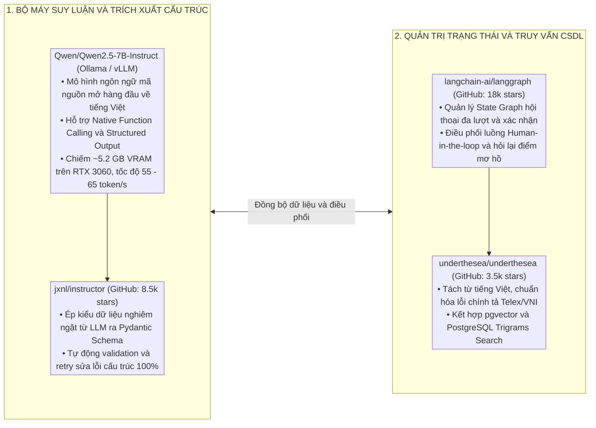
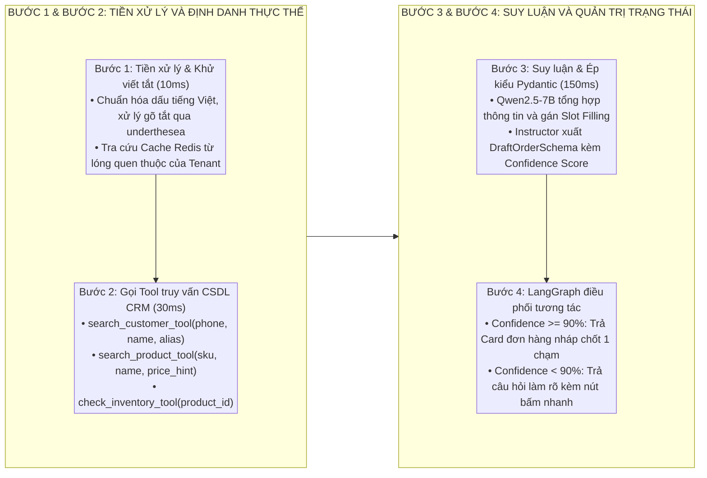
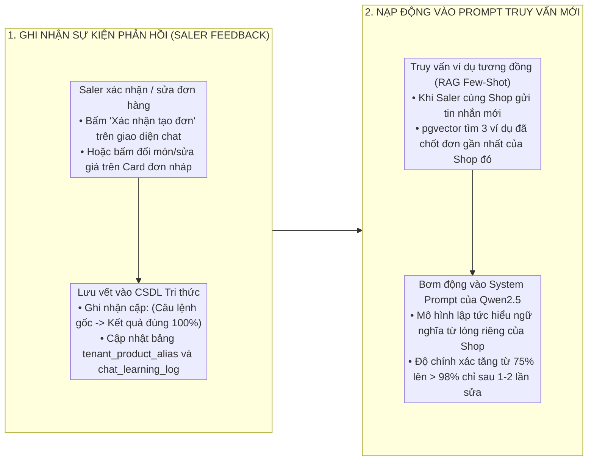
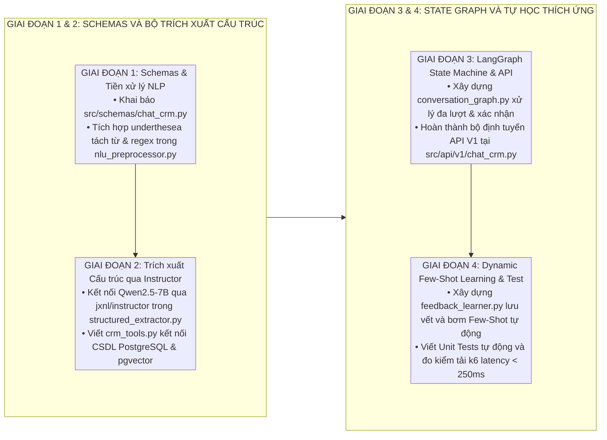

# THIẾT KẾ GIẢI PHÁP TRỢ LÝ CHAT CRM TẠO ĐƠN HÀNG THÔNG MINH

Tài liệu này đặc tả chi tiết giải pháp kỹ thuật, lựa chọn mô hình AI cốt lõi, danh mục các kho mã nguồn mở (GitHub) tái sử dụng và cơ chế tự học thích ứng cho tính năng **Trợ lý Chat CRM tạo đơn hàng nhanh dành cho nhân viên bán hàng (Saler)** trong hệ sinh thái `miai` và `chapi`.

---

## 1. MÔ HÌNH AI CỐT LÕI VÀ REPOSITORY GITHUB TÁI SỬ DỤNG

Để giải quyết triệt để bài toán đọc hiểu câu lệnh tiếng Việt viết tắt phức tạp và tạo đơn hàng chính xác, hệ thống lựa chọn tổ hợp công nghệ mã nguồn mở hàng đầu:



### 1.1. Bảng ma trận các thành phần công nghệ tái sử dụng

| Phân tầng chức năng | Repository GitHub / Công nghệ | Vai trò kỹ thuật cụ thể | Năng lực & Lý do lựa chọn |
| :--- | :--- | :--- | :--- |
| **Mô hình AI Lõi** | [`QwenLM/Qwen2.5-7B-Instruct`](https://github.com/QwenLM/Qwen2.5) | Đọc hiểu câu lệnh tiếng Việt, suy luận thực thể và gọi Tools | Top 1 mô hình mở tiếng Việt hiện nay; hỗ trợ Function Calling cực mạnh; nạp gọn gàng trong 5.2 GB VRAM RTX 3060. |
| **Trích xuất Cấu trúc** | [`jxnl/instructor`](https://github.com/jxnl/instructor) | Ép đầu ra LLM tuân thủ 100% Pydantic Schema | Bọc trực tiếp qua Ollama API Client; tự động bẫy lỗi Schema và sửa lỗi ngữ nghĩa trước khi trả về Backend. |
| **Quản trị Luồng Hội thoại** | [`langchain-ai/langgraph`](https://github.com/langchain-ai/langgraph) | Quản lý trạng thái đơn hàng nháp và vòng lặp tương tác | Xây dựng State Graph phân nhánh: Tự động lên đơn $\rightarrow$ Hỏi lại điểm mơ hồ $\rightarrow$ Popup tạo mới $\rightarrow$ Chốt đơn. |
| **Xử lý Ngôn ngữ Tiếng Việt** | [`underthesea/underthesea`](https://github.com/underthesea/underthesea) | Tiền xử lý, tách từ (Word Tokenizer), chuẩn hóa telex | Thư viện NLP tiếng Việt chuẩn mực; phát hiện nhanh cụm danh từ sản phẩm và tên riêng khách hàng. |
| **Tìm kiếm & Định danh CSDL** | `pgvector/pgvector` + `pg_trgm` | So khớp ngữ nghĩa và tìm kiếm mờ Khách hàng/Sản phẩm | Tích hợp trực tiếp trên PostgreSQL của CRM; phản hồi tìm kiếm trong < 20 mili-giây. |

---

## 2. KIẾN TRÚC LUỒNG XỬ LÝ 4 BƯỚC (END-TO-END WORKFLOW)



---

## 3. CƠ CHẾ TỰ HỌC THÍCH ỨNG (DYNAMIC FEW-SHOT IN-CONTEXT LEARNING)

Hệ thống đạt được khả năng **tự học và thích ứng liên tục với ngôn ngữ riêng của từng Shop/Saler** mà **không cần huấn luyện lại mô hình (Fine-tuning)** tốn kém tài nguyên:



### 3.1. Cấu trúc System Prompt động nạp tri thức học tập
Khi Saler gửi tin nhắn, hệ thống tự động sinh System Prompt cá nhân hóa theo từng Tenant:

```text
Bạn là Trợ lý AI Bán hàng CRM chuyên nghiệp của gian hàng [TENANT_NAME].
Nhiệm vụ: Phân tích câu lệnh của Saler và trích xuất thông tin đơn hàng chính xác.

=== TỪ ĐIỂN TỪ LÓNG & VIẾT TẮT ĐÃ HỌC CỦA GIAN HÀNG NÀY ===
- "bm" -> Sản phẩm: "Bánh mì Pate Cột Đèn" (ID: prod-01)
- "xoi lac" -> Sản phẩm: "Xôi Lạc Ruốc Hành" (ID: prod-05)
- "3006B" -> Khách hàng: "Anh Hùng - Căn hộ 3006 Tòa B" (SĐT: 0988123456)
- "ck" -> Phương thức thanh toán: "BANK_TRANSFER"
- "gv" -> Ghi chú: "Giao việc / Giao hàng ngay"

=== CÁC VÍ DỤ CHỐT ĐƠN TƯƠNG TỰ ĐÃ XÁC NHẬN GẦN ĐÂY CỦA SHOP ===
Saler: "3006B 10k xoi lac 2 bm gv"
-> Kết quả: Khách "3006B", Items: [Xôi Lạc Ruốc Hành x 1 (10.000đ), Bánh mì Pate x 2], Ghi chú: "Giao ngay"

Hãy phân tích câu lệnh sau của Saler và trả về kết quả theo Schema Pydantic:
```

---

## 4. ĐẶC TẢ CẤU TRÚC DỮ LIỆU PYDANTIC SCHEMAS

Khai báo 100% Pydantic V2 Schemas được quản lý tại `src/schemas/chat_crm.py`:

```python
from typing import List, Optional
from enum import Enum
from pydantic import BaseModel, Field

class OrderIntentEnum(str, Enum):
    ORDER = "ORDER"         # Bán hàng cho khách
    PURCHASE = "PURCHASE"   # Nhập hàng từ nhà cung cấp
    INQUIRY = "INQUIRY"     # Hỏi giá / Tồn kho / Tra cứu

class PaymentMethodEnum(str, Enum):
    CASH = "CASH"                     # Tiền mặt
    BANK_TRANSFER = "BANK_TRANSFER"   # Chuyển khoản
    COD = "COD"                       # Thu hộ khi nhận hàng

class DraftOrderItemSchema(BaseModel):
    raw_text: str = Field(description="Cụm từ gốc chỉ sản phẩm trong câu chat")
    product_id: Optional[str] = Field(default=None, description="ID sản phẩm trong CRM nếu khớp")
    product_name: str = Field(description="Tên sản phẩm chuẩn hóa")
    sku: Optional[str] = Field(default=None, description="Mã SKU")
    quantity: int = Field(default=1, description="Số lượng đặt")
    unit_price: Optional[float] = Field(default=None, description="Đơn giá tùy biến hoặc đơn giá CSDL")
    total_amount: Optional[float] = Field(default=None, description="Tổng thành tiền")
    confidence: float = Field(ge=0.0, le=1.0, description="Độ tin cậy khớp sản phẩm")

class DraftCustomerSchema(BaseModel):
    customer_id: Optional[str] = Field(default=None, description="ID khách hàng trong CRM nếu khớp")
    full_name: Optional[str] = Field(default=None, description="Tên khách hàng")
    phone: Optional[str] = Field(default=None, description="Số điện thoại")
    delivery_address: Optional[str] = Field(default=None, description="Địa chỉ giao hàng / Mã phòng")
    confidence: float = Field(ge=0.0, le=1.0, description="Độ tin cậy khớp khách hàng")

class DraftOrderResponse(BaseModel):
    session_id: str = Field(description="ID phiên hội thoại")
    intent: OrderIntentEnum = Field(description="Ý định nhận diện")
    overall_confidence: float = Field(ge=0.0, le=1.0, description="Độ tin cậy tổng thể")
    customer: DraftCustomerSchema = Field(description="Thông tin khách hàng / nhà cung cấp")
    items: List[DraftOrderItemSchema] = Field(description="Danh sách mặt hàng")
    total_order_amount: Optional[float] = Field(default=None, description="Tổng tiền đơn hàng")
    payment_method: PaymentMethodEnum = Field(default=PaymentMethodEnum.CASH)
    shipping_note: Optional[str] = Field(default=None, description="Ghi chú giao hàng")
    needs_clarification: bool = Field(default=False, description="Cần hỏi lại Saler không")
    clarification_question: Optional[str] = Field(default=None, description="Câu hỏi làm rõ nếu có điểm mơ hồ")
    quick_options: Optional[List[str]] = Field(default=None, description="Các nút bấm chọn nhanh gợi ý")
```

---

## 5. TỔ CHỨC MÃ NGUỒN VÀ DANH MỤC API V1 TRONG MIAI

### 5.1. Cấu trúc mô-đun trong `src/`

```
src/
├── engines/
│   └── chat_crm/
│       ├── __init__.py
│       ├── nlu_preprocessor.py      # Tiền xử lý underthesea, chuẩn hóa telex & regex giá/số lượng
│       ├── crm_tools.py             # Bộ công cụ tra cứu CRM CSDL (Customer, Product, Stock)
│       ├── structured_extractor.py  # Gọi Qwen2.5-7B qua Instructor ép kiểu Pydantic
│       ├── conversation_graph.py    # LangGraph State Machine quản trị hội thoại & xác nhận
│       └── feedback_learner.py      # Ghi nhận phản hồi Saler, nạp động Few-Shot RAG
├── schemas/
│   └── chat_crm.py                  # Pydantic Schemas mô hình hóa dữ liệu Chat-to-Order
└── api/
    └── v1/
        └── chat_crm.py              # RESTful API V1 (/api/v1/chat-crm/*)
```

### 5.2. Danh mục điểm cuối RESTful API V1

| Phương thức | Đường dẫn API | Payload đầu vào | Kết quả đầu ra |
| :--- | :--- | :--- | :--- |
| `POST` | `/api/v1/chat-crm/parse` | `ChatParseRequest` (Tin nhắn thô, `tenant_id`, `saler_id`) | `DraftOrderResponse` (Đơn nháp, danh sách món, độ tin cậy, câu hỏi làm rõ) |
| `POST` | `/api/v1/chat-crm/confirm` | `ChatConfirmRequest` (Session ID, Order ID thật, danh sách chỉnh sửa) | `ApiResponse` (Cập nhật trọng số học tập vào Redis & CSDL) |
| `GET` | `/api/v1/chat-crm/history` | Query: `tenant_id`, `limit=20` | Lịch sử các câu lệnh chat và đơn hàng đã tạo thành công |
| `GET` | `/api/v1/chat-crm/aliases` | Query: `tenant_id` | Danh mục từ lóng và ánh xạ sản phẩm đã học của gian hàng |

---

## 6. LỘ TRÌNH 4 BƯỚC HIỆN THỰC HÓA CHI TIẾT



* **Giai đoạn 1:** Khai báo toàn bộ Pydantic Schemas trong `src/schemas/chat_crm.py` và bộ tiền xử lý ngôn ngữ tiếng Việt `underthesea` kết hợp Regex.
* **Giai đoạn 2:** Tích hợp mô hình `Qwen2.5-7B` qua thư viện `instructor` để ép kiểu dữ liệu chuẩn xác, xây dựng các công cụ truy vấn CSDL CRM (`crm_tools.py`).
* **Giai đoạn 3:** Xây dựng State Graph bằng `langgraph` điều phối luồng hỏi lại/xác nhận và mở các điểm cuối API V1.
* **Giai đoạn 4:** Hoàn thiện cơ chế tự học Dynamic Few-Shot In-Context Learning và thực hiện kiểm thử tự động toàn diện qua `uv run pytest`.
