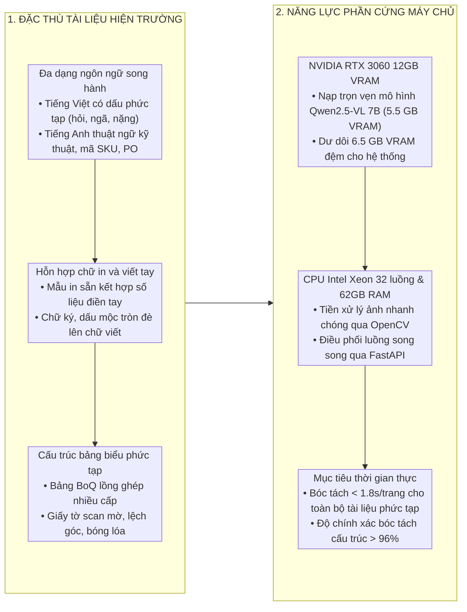
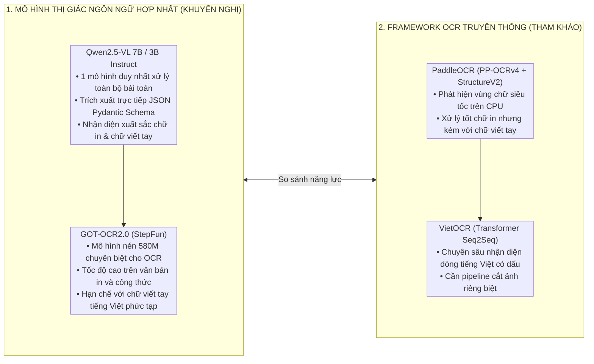
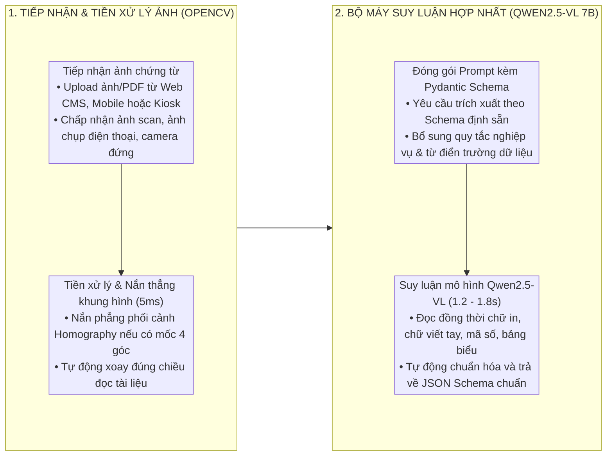
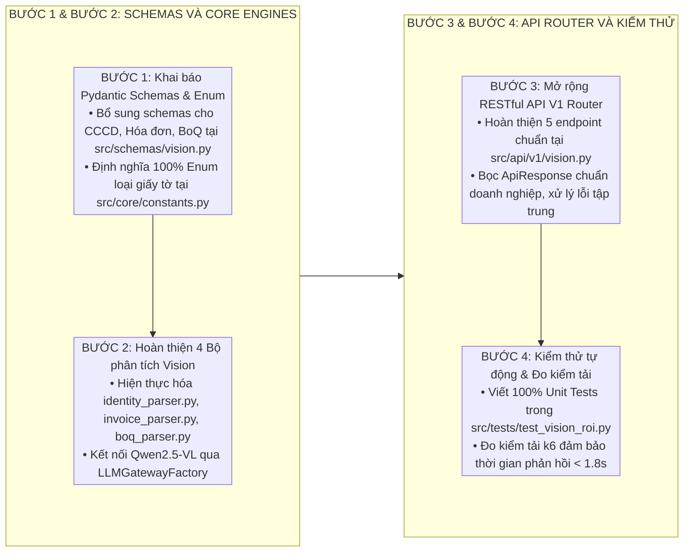

# BÓC TÁCH VĂN BẢN VÀ THỊ GIÁC MÁY TÍNH

Tài liệu này đặc tả kết quả nghiên cứu, khảo sát các kho mã nguồn mở trên GitHub và phương án triển khai kiến trúc bóc tách văn bản và thị giác máy tính phục vụ nhận diện đồng thời **chữ in và chữ viết tay**, **song ngữ Tiếng Việt và Tiếng Anh**, trên các loại tài liệu thực tế (**hóa đơn VAT, bảng BoQ, giấy tờ tùy thân CCCD/Hộ chiếu, biểu mẫu FDI**) trên máy chủ `micro-server` (GPU NVIDIA RTX 3060 12GB GDDR6, CPU Xeon 32 luồng, 62GB RAM).

---

## 1. TỔNG QUAN VÀ BỐI CẢNH



Trong hệ sinh thái quản trị doanh nghiệp và chuỗi cung ứng, việc số hóa tự động các loại hồ sơ chứng từ giấy tờ đóng vai trò then chốt để loại bỏ thao tác nhập liệu thủ công. Hệ thống đối mặt với 3 thách thức kỹ thuật lớn:
1. **Hỗn hợp chữ in và chữ viết tay:** Các biểu mẫu và chứng từ (phiếu cân, phiếu xuất kho, hóa đơn, hồ sơ hiện trường) thường in sẵn khung cấu trúc và người dùng điền thêm chữ viết tay (số lượng thực tế, ngày giờ, chữ ký, ghi chú hiện trường).
2. **Song ngữ Tiếng Việt và Tiếng Anh đồng thời:** Tài liệu chứa các từ tiếng Việt có dấu phức tạp đan xen thuật ngữ tiếng Anh, mã sản phẩm (SKU), số PO và số serial.
3. **Cấu trúc bảng biểu và chất lượng ảnh đa dạng:** Giấy tờ scan nghiêng, nhăn, mờ, lóa đèn trần hoặc bảng biểu BoQ dự toán phức tạp lồng ghép nhiều tầng.

---

## 2. MA TRẬN MÔ HÌNH MÃ NGUỒN MỞ



### 2.1. Bảng ma trận so sánh chi tiết các công nghệ

| Dự án / Repository GitHub | Kiến trúc mạng & Công nghệ | Độ chính xác Tiếng Việt | Độ chính xác Chữ viết tay | Mức chiếm VRAM GPU | Đánh giá & Khả năng ứng dụng |
| :--- | :--- | :---: | :---: | :---: | :--- |
| **`QwenLM/Qwen2.5-VL`** | Vision-Language Model thế hệ mới (7B/3B), hiểu ngữ cảnh sâu | **> 96% (Xuất sắc)** | **> 92% (Xuất sắc)** | **5.5 GB** (7B-Q4)<br/>**2.8 GB** (3B-Q4) | **Lựa chọn chuẩn mực số 1:** 1 mô hình duy nhất bóc tách toàn diện chữ in, viết tay, hóa đơn, BoQ và CCCD trực tiếp ra JSON Pydantic. |
| **`PaddlePaddle/PaddleOCR`** | PP-OCRv4 (DBNet++ Detection + SVTR Recognition) | **> 93% (Rất tốt)** | **~ 82-85% (Khá)** | 0 MB (Chạy CPU) | **Khung OCR truyền thống:** Phù hợp nếu máy chủ không có GPU; đọc bảng BoQ và chữ viết tay kém hơn VLM. |
| **`pbcquoc/vietocr`** | VGG19/ResNet + Transformer Seq2Seq chuyên biệt Tiếng Việt | **> 95% (Xuất sắc)** | **> 88% (Rất tốt)** | 0 MB (Chạy CPU) | **Chuyên trị tiếng Việt:** Cần kết hợp với bộ cắt ảnh (Detector) bên ngoài, không tự hiểu bố cục tài liệu. |
| **`VikParuchuri/surya`** | SegFormer Detection + Multilingual Text & Layout Analysis | **> 90% (Tốt)** | **~ 80% (Khá)** | ~2.0 GB VRAM | Phân tích bố cục tốt, nhưng độ chính xác tiếng Việt viết tay chưa bằng Qwen2.5-VL. |
| **`microsoft/unilm` (TrOCR)** | Vision Transformer (ViT) + RoBERTa Decoder | **~ 85% (Khá)** | **> 90% (Viết tay EN)** | ~1.5 GB VRAM | Nhận diện chữ viết tay tiếng Anh tốt, cần huấn luyện lại với dữ liệu tiếng Việt. |
| **`Ucas-HaoranWei/GOT-OCR2.0`** | General OCR Theory 580M tham số | **~ 88% (Khá)** | **~ 86% (Tốt)** | ~1.5 GB VRAM | Nhẹ, xử lý tốt văn bản định dạng và công thức toán học. |

---

## 3. PHƯƠNG ÁN KIẾN TRÚC CHỐT TRIỂN KHAI

Hệ thống sử dụng **DUY NHẤT 1 MÔ HÌNH THỊ GIÁC NGÔN NGỮ (`Qwen2.5-VL 7B-Instruct`)** chạy qua Ollama trên GPU RTX 3060. Mô hình này đóng vai trò là bộ máy hợp nhất giải quyết trọn gói toàn bộ các bài toán bóc tách tài liệu:



---

## 4. PHÂN BỔ TÀI NGUYÊN MÁY CHỦ MICRO-SERVER

Chỉ có **duy nhất 1 mô hình Vision-LLM** được nạp trên GPU cho toàn bộ các tác vụ bóc tách tài liệu:

| Thành phần phục vụ | Môi trường thực thi | Mức chiếm VRAM GPU | CPU Xeon 32 luồng | RAM hệ thống | Tốc độ đáp ứng |
| :--- | :--- | :---: | :---: | :---: | :--- |
| **Qwen2.5-VL:7b-instruct** | GPU CUDA (Ollama Q4_K_M) | **5.5 GB** | 2 – 5% | 1.5 GB | **1.2 – 1.8 giây/trang** |
| **Bộ đệm an toàn & KV Cache** | GPU GDDR6 | **2.5 GB** | — | — | Đảm bảo tính toán ổn định |
| **VRAM trống khả dụng** | Dự phòng cho hệ thống | **4.0 GB** | — | — | Dư dôi tài nguyên an toàn |
| **TỔNG CỘNG HỆ THỐNG OCR** | **Mô hình Hợp nhất** | **5.5 GB / 12 GB** | **2 – 5%** | **1.5 GB / 62 GB** | **Vận hành an toàn, siêu nhẹ** |

---

## 5. ĐẶC TẢ CHI TIẾT 4 PHÂN HỆ NGHIỆP VỤ

### 5.1. Phân hệ Bóc tách Giấy tờ tùy thân (`identity_parser.py`)
* **Đối tượng:** Căn cước công dân gắn chip, CMND 9/12 số, Hộ chiếu, Giấy phép lái xe.
* **Cấu trúc trường dữ liệu trích xuất:**
  * `document_type`: Loại giấy tờ (`CCCD_CHIP`, `CMND_9`, `CMND_12`, `PASSPORT`, `DRIVER_LICENSE`).
  * `id_number`: Số định danh cá nhân (12 chữ số đối với CCCD).
  * `full_name`: Họ và tên đầy đủ (chữ in hoa tiếng Việt có dấu).
  * `date_of_birth`, `gender`, `nationality`: Ngày sinh, giới tính, quốc tịch.
  * `origin_place`, `residence_place`: Quê quán, nơi thường trú.
  * `issue_date`, `expiry_date`: Ngày cấp, ngày hết hạn.
  * `mrz_code`: Chuỗi ký tự đọc máy chuẩn ICAO Doc 9303 (trên Hộ chiếu / mặt sau CCCD).
* **Kiểm tra an toàn & PII:** Tự động kiểm tra tính hợp lệ của số CCCD theo quy tắc 3 chữ số đầu (Mã tỉnh/thành phố), 1 chữ số giới tính/thế kỷ và 2 chữ số năm sinh; làm mờ các trường nhạy cảm theo quy định bảo mật.

### 5.2. Phân hệ Bóc tách Hóa đơn VAT & Phiếu cân (`invoice_parser.py`)
* **Đối tượng:** Hóa đơn điện tử VAT (XML chuyển đổi hoặc bản PDF/scan), Phiếu xuất nhập kho, Phiếu cân xe tải.
* **Cấu trúc trường dữ liệu trích xuất:**
  * Thông tin đơn vị bán và mua: Tên doanh nghiệp, Mã số thuế, Địa chỉ, Số tài khoản ngân hàng.
  * Thông tin hóa đơn: Ký hiệu mẫu số, Ký hiệu hóa đơn, Số hóa đơn, Ngày lập.
  * Danh sách hàng hóa dịch vụ: Bảng chi tiết từng dòng (`item_name`, `unit`, `quantity`, `unit_price`, `amount`, `vat_rate`, `vat_amount`).
  * Tổng hợp thanh toán: Tổng tiền chưa thuế, Tổng tiền thuế VAT, Tổng tiền thanh toán bằng số và bằng chữ.

### 5.3. Phân hệ Bóc tách Biểu mẫu FDI Hiện trường (`roi_extractor.py`)
* **Đối tượng:** Phiếu giao nhận hàng, biên bản kiểm nghiệm chất lượng song ngữ (Việt - Anh, Việt - Trung, Việt - Hàn).
* **Luồng xử lý:** `Qwen2.5-VL` nhận diện đồng thời các trường in cố định và bóc tách các ô chữ viết tay biến động (Số lượng thực giao, Số cân thực tế, Tên tài xế, kiểm tra sự tồn tại của Chữ ký xác nhận).

### 5.4. Phân hệ Bóc tách Bảng dự toán BoQ (`boq_parser.py`)
* **Đối tượng:** Bảng khối lượng dự toán xây dựng/đấu thầu nhiều trang, nhiều cấp mục cha con.
* **Luồng xử lý:** Mô hình tự động phân tách danh mục hạng mục công trình, mã hiệu đơn giá, khối lượng mời thầu, đơn giá dự thầu và thành tiền thành danh sách đối tượng Pydantic.

---

## 6. TỔ CHỨC MÃ NGUỒN VÀ DANH MỤC API V1

### 6.1. Cấu trúc mô-đun trong `src/`

```
src/
├── engines/
│   └── vision/
│       ├── homography.py          # Thuật toán nắn phẳng phối cảnh OpenCV (5ms)
│       ├── ocr_reader.py          # Bộ điều phối gọi Qwen2.5-VL qua Ollama
│       ├── roi_extractor.py       # Trích xuất dữ liệu biểu mẫu FDI
│       ├── identity_parser.py     # Bóc tách CCCD gắn chip, CMND, Hộ chiếu, GPLX
│       ├── invoice_parser.py      # Bóc tách Hóa đơn điện tử VAT & Phiếu cân kho
│       └── boq_parser.py          # Bóc tách Bảng dự toán BoQ đa tầng
├── schemas/
│   └── vision.py                  # 100% Pydantic Schemas mô hình hóa Request/Response
└── api/
    └── v1/
        └── vision.py              # Bộ định tuyến RESTful API V1 (/api/v1/vision/*)
```

### 6.2. Danh mục 5 điểm cuối RESTful API V1

| Phương thức | Đường dẫn API | Payload đầu vào | Kết quả đầu ra |
| :--- | :--- | :--- | :--- |
| `POST` | `/api/v1/vision/ocr/extract` | Ảnh gốc (Base64/File) | Danh sách đoạn văn bản, tọa độ bounding box, độ tự tin |
| `POST` | `/api/v1/vision/identity/extract` | Ảnh 2 mặt CCCD / Hộ chiếu | `IdentityCardResponse` (Đầy đủ thông tin cá nhân + Mã MRZ) |
| `POST` | `/api/v1/vision/invoice/extract` | Ảnh hóa đơn / Phiếu cân | `InvoiceResponse` (Mã số thuế, Ngày, Bảng hàng hóa, Tổng tiền) |
| `POST` | `/api/v1/vision/fdi/extract` | Ảnh chụp biểu mẫu hiện trường | `FdiExtractionResponse` (Mã chứng từ, Giá trị từng vùng ROI) |
| `POST` | `/api/v1/vision/boq/extract` | Ảnh/PDF bảng dự toán BoQ | `BoqExtractionResponse` (Danh sách dòng công tác phân cấp) |

---

## 7. LỘ TRÌNH 4 BƯỚC HIỆN THỰC HÓA CHI TIẾT



* **Bước 1:** Chuẩn hóa toàn bộ cấu trúc dữ liệu Pydantic Schemas trong `src/schemas/vision.py` và các hằng số Enum loại giấy tờ trong `src/core/constants.py`.
* **Bước 2:** Hiện thực hóa các bộ bóc tách chuyên biệt (`identity_parser.py`, `invoice_parser.py`, `boq_parser.py`, `roi_extractor.py`) trong `src/engines/vision/` kết nối trực tiếp với mô hình `qwen2.5vl:7b`.
* **Bước 3:** Đăng ký các điểm cuối RESTful API trong `src/api/v1/vision.py` kết nối thông suốt với các bộ bóc tách.
* **Bước 4:** Viết bài kiểm thử tự động toàn diện trong `src/tests/` và chạy `uv run pytest` đảm bảo pass 100%.
