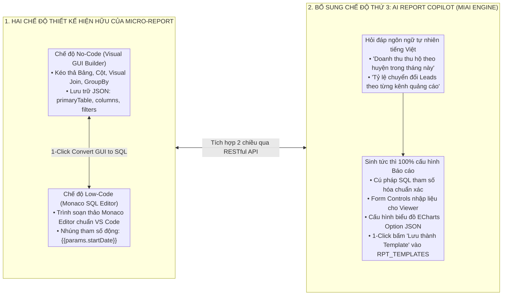
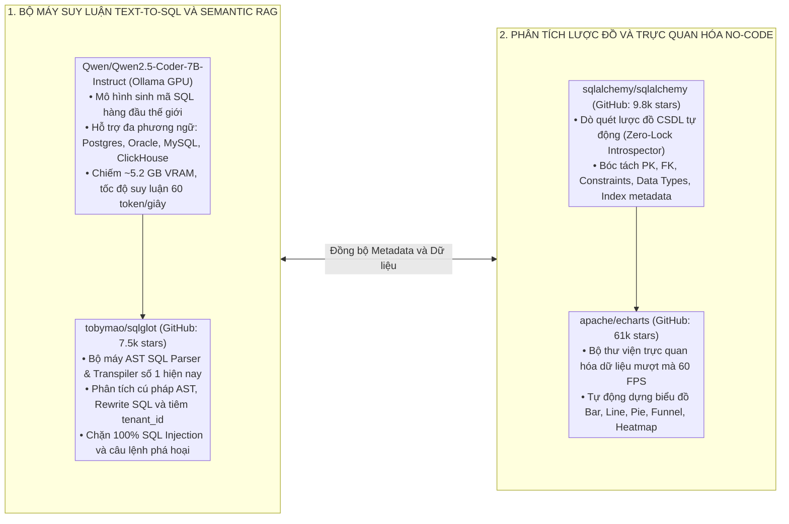
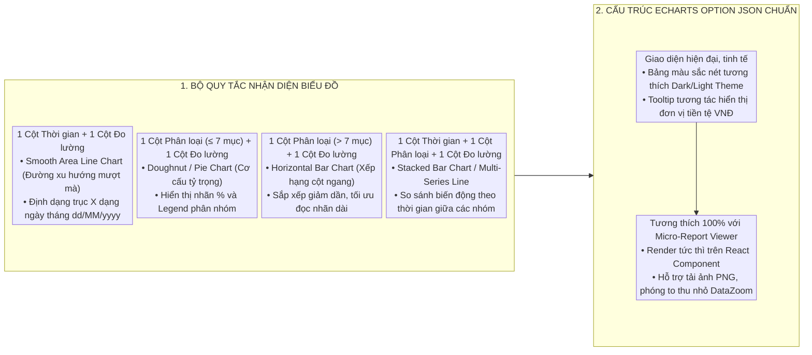
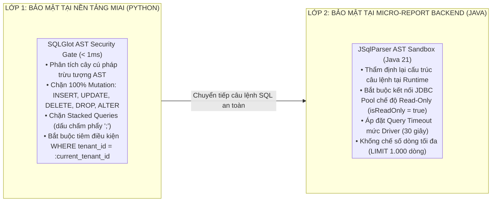

# THIẾT KẾ GIẢI PHÁP AI QUERY VÀ BÁO CÁO ĐỘNG NO-CODE TỐI ƯU CHO MICRO-REPORT

Tài liệu này đặc tả chi tiết kiến trúc giải pháp kỹ thuật, cơ chế tự động phân tích lược đồ CSDL, quy chuẩn sinh câu truy vấn tối ưu, bảo mật AST Sandbox hai lớp và chuyển hóa dữ liệu thành biểu đồ trực quan tích hợp trực tiếp vào **Hệ thống Báo Cáo Động Lai Độc Lập Micro-Report (Standalone Hybrid Dynamic Report Engine)** phục vụ toàn bộ hệ sinh thái `DIP Platform`, `Micro-CRM`, `Natcash`, `NexaFlow MES` và `Micro-ERP`.

---

## 1. TỔNG QUAN KIẾN TRÚC VÀ TÍNH NĂNG NỔI BẬT

### 1.1. Bối cảnh hệ thống Micro-Report
**Micro-Report** là phân hệ Báo cáo Động Độc lập (Standalone Microservice) được xây dựng theo kiến trúc Hexagonal với Backend **Java 21 / Spring Boot 3** và Frontend **Next.js 14 / Monaco Editor / Apache ECharts**. Hệ thống quản lý kho kết nối CSDL động (`RPT_DATASOURCES`) và lưu trữ các mẫu báo cáo (`RPT_TEMPLATES`) phục vụ đa người thuê (`TENANT_ID`).

Hiện tại, Micro-Report hỗ trợ 2 chế độ thiết kế:
* **Chế độ No-Code (Visual GUI Builder):** Kéo thả trường dữ liệu, Visual Join Builder, bộ lọc phân cấp `AND`/`OR`, lưu dưới dạng `MODE = 'GUI'` (JSON cấu trúc).
* **Chế độ Low-Code (Monaco SQL Query Editor):** Soạn thảo SQL chuẩn VS Code, nhúng tham số động `{{params.var}}` hoặc `:param_name`, lưu dưới dạng `MODE = 'SQL'`.



---

## 2. MÔ HÌNH AI CỐT LÕI VÀ REPOSITORY GITHUB TÁI SỬ DỤNG

Để đảm bảo khả năng vận hành On-Premise trên máy chủ GPU `micro-server` (RTX 3060 12GB VRAM), hệ thống kết hợp các công nghệ mã nguồn mở hàng đầu:



### 2.1. Bảng ma trận công nghệ và vai trò kỹ thuật

| Phân tầng chức năng | Repository GitHub / Công nghệ | Vai trò kỹ thuật cụ thể | Năng lực & Lý do lựa chọn |
| :--- | :--- | :--- | :--- |
| **Mô hình AI SQL Lõi** | [`QwenLM/Qwen2.5-Coder-7B-Instruct`](https://github.com/QwenLM/Qwen2.5-Coder) | Đọc hiểu câu hỏi tiếng Việt, suy luận cấu trúc bảng và sinh SQL tối ưu | Top 1 Text-to-SQL Benchmark (Spider 86.2%, BIRD 65.4%); hỗ trợ đa phương ngữ; nạp an toàn trong 5.2 GB VRAM. |
| **Bảo mật & AST Sandbox Tầng 1** | [`tobymao/sqlglot`](https://github.com/tobymao/sqlglot) | Phân tích cây cú pháp AST, kiểm duyệt Read-Only và tiêm điều kiện `tenant_id` | Tốc độ phân tích < 1ms bằng Python; hỗ trợ rewrite AST không làm biến dạng logic câu truy vấn; chặn 100% Mutation. |
| **Bảo mật & AST Sandbox Tầng 2** | `JSqlParser` (Java Spring Boot) | Thẩm định lại câu truy vấn tại Runtime trước khi gửi xuống JDBC Pool | Đảm bảo nguyên lý phòng thủ chiều sâu 2 lớp (Defense-in-Depth). |
| **Dò quét Lược đồ CSDL** | [`sqlalchemy/sqlalchemy`](https://github.com/sqlalchemy/sqlalchemy) | Quét tự động Metadata, khóa chính, khóa ngoại và chỉ mục bảng | Hỗ trợ 100% CSDL doanh nghiệp: PostgreSQL, ClickHouse, MySQL, Oracle, SQL Server. |
| **Bản đồ Ngữ nghĩa Semantic Catalog** | `pgvector/pgvector` + `BGE-M3` | Lưu trữ Semantic Embeddings của Lược đồ CSDL và Golden SQLs | Cho phép Schema Pruning (chỉ nạp 3 - 5 bảng liên quan nhất vào Prompt), giảm 80% Token tiêu thụ. |
| **Bộ máy Trực quan hóa** | [`apache/echarts`](https://github.com/apache/echarts) | Render biểu đồ tương tác cao trên Web Next.js 14 | Hỗ trợ biểu đồ động 60 FPS, Responsive, xuất ảnh PNG/PDF báo cáo tức thì. |

---

## 3. KIẾN TRÚC LUỒNG XỬ LÝ 5 TẦNG TÍCH HỢP VỚI MICRO-REPORT

```mermaid
%%{init: {'flowchart': {'nodeSpacing': 8, 'rankSpacing': 140, 'padding': 3, 'curve': 'basis'}}}%%
flowchart LR
    subgraph S_MIAI_PIPELINE ["1. BỘ MÁY SUY LUẬN VÀ KIỂM DUYỆT TẠI MIAI ENGINE"]
        direction TB
        STEP_INTRO["Tầng 1: Dò quét Lược đồ CSDL (Zero-Lock Introspection)<br/>• Quét danh mục Bảng, Cột, Khóa chính, Khóa ngoại<br/>• BGE-M3 lập bản đồ ngữ nghĩa Semantic Catalog"]
        STEP_PRUNE["Tầng 2: Schema Pruning RAG qua pgvector<br/>• Tiếp nhận câu hỏi tiếng Việt từ Micro-Report<br/>• Trích xuất Top 3-5 bảng liên quan nhất (< 800 Token)"]
        STEP_GEN["Tầng 3: Qwen2.5-Coder sinh SQL & Tham số động<br/>• Sinh câu lệnh SQL tối ưu theo phương ngữ CSDL<br/>• Tự động bóc tách tham số form: {{params.startDate}}"]
        STEP_AST["Tầng 4: SQLGlot AST Sandbox & Tenant Injection<br/>• Kiểm duyệt Read-Only SELECT, chặn 100% Mutation<br/>• Tiêm điều kiện WHERE tenant_id = :current_tenant_id"]
        STEP_INTRO --> STEP_PRUNE
        STEP_PRUNE --> STEP_GEN
        STEP_GEN --> STEP_AST
    end

    subgraph S_MICRO_REPORT_CONSUME ["2. TIẾP NHẬN & HIỂN THỊ TẠI MICRO-REPORT"]
        direction TB
        MR_RECEIVE["Tầng 5: Micro-Report tiếp nhận & Render trực quan<br/>• Đẩy SQL vào Monaco Query Editor để Saler/Admin xem<br/>• Tự động render biểu đồ ECharts Option JSON<br/>• Tự động tạo Form Parameters cho Standalone Viewer"]
        MR_PERSIST["1-Click Lưu Mẫu Báo Cáo vào RPT_TEMPLATES<br/>• Ghi nhận bản ghi mới vào CSDL Metadata<br/>• Xuất bản Menu con lên Sidebar của DIP / Micro-CRM"]
        MR_RECEIVE --> MR_PERSIST
    end

    STEP_AST -->|Trả kết quả qua REST API /api/v1/analytics/report-copilot| MR_RECEIVE
```



---

## 4. CHI TIẾT CÁC MODULE KỸ THUẬT TỐI ƯU CHO MICRO-REPORT

### 4.1. Module 1: Tự động trích xuất Tham số Động (Dynamic Parameter Extractor)
Điểm đặc biệt của Micro-Report là màn hình **Standalone Report Viewer** yêu cầu có Form Controls để người dùng cuối (kế toán, nhân viên bán hàng) có thể tự lọc ngày tháng, chi nhánh, trạng thái.

Khi AI nhận câu hỏi: *"Doanh thu thu hộ theo từng huyện từ ngày A đến ngày B theo trạng thái đơn"*, bộ máy AI không gán cứng giá trị ngày tháng mà tự động tham số hóa thành cú pháp Micro-Report:

```sql
SELECT 
    d.district_name AS "TenHuyen",
    COUNT(d.id) AS "SoLuongHoSo",
    COALESCE(SUM(d.total_amount), 0) AS "TongDoanhThu"
FROM fact_dossiers d
WHERE d.tenant_id = :tenant_id
  AND (:start_date IS NULL OR d.created_at >= :start_date)
  AND (:end_date IS NULL OR d.created_at <= :end_date)
  AND (:status IS NULL OR d.status = :status)
GROUP BY d.district_name
ORDER BY "TongDoanhThu" DESC
LIMIT 1000;
```

Đồng thời, AI tự động sinh ra danh mục cấu hình Form Parameters tương ứng:
```json
[
  {
    "param_name": "start_date",
    "param_label": "Từ ngày",
    "param_type": "DATE",
    "default_value": "FIRST_DAY_OF_MONTH",
    "is_required": false
  },
  {
    "param_name": "end_date",
    "param_label": "Đến ngày",
    "param_type": "DATE",
    "default_value": "CURRENT_DATE",
    "is_required": false
  },
  {
    "param_name": "status",
    "param_label": "Trạng thái hồ sơ",
    "param_type": "SELECT",
    "options": ["COMPLETED", "PENDING", "CANCELLED"],
    "is_required": false
  }
]
```

---

### 4.2. Module 2: Bộ sinh cấu hình ECharts Option JSON tương thích Frontend Next.js 14
Micro-Report sử dụng Apache ECharts trên giao diện Web Next.js 14. Bộ quy tắc chọn biểu đồ tự động (Heuristics) của MIAI sinh ra cấu hình ECharts chuẩn hóa:



---

### 4.3. Module 3: Phòng thủ Chiều Sâu 2 Lớp (Defense-in-Depth Security)
Sự kết hợp giữa `miai` và `micro-report` tạo nên hệ thống bảo mật 2 lớp bất khả xâm phạm:



---

## 5. CẤU TRÚC SCHEMAS DỮ LIỆU CHUẨN HÓA (PYDANTIC V2 CONTRACTS)

Toàn bộ thông tin trao đổi giữa **Micro-Report Engine** và **MIAI Platform** được chuẩn hóa qua các Pydantic V2 Schemas:

```python
from typing import List, Optional, Dict, Any
from pydantic import BaseModel, Field
from enum import Enum, unique

@unique
class DatabaseDialect(str, Enum):
    POSTGRESQL = "POSTGRESQL"
    CLICKHOUSE = "CLICKHOUSE"
    MYSQL = "MYSQL"
    ORACLE = "ORACLE"
    SQLSERVER = "SQLSERVER"

@unique
class ReportMode(str, Enum):
    GUI = "GUI"
    SQL = "SQL"

@unique
class ParameterType(str, Enum):
    DATE = "DATE"
    DATE_RANGE = "DATE_RANGE"
    SELECT = "SELECT"
    TEXT = "TEXT"
    NUMBER = "NUMBER"

@unique
class ChartType(str, Enum):
    LINE = "LINE"
    AREA_LINE = "AREA_LINE"
    BAR = "BAR"
    HORIZONTAL_BAR = "HORIZONTAL_BAR"
    PIE = "PIE"
    DOUGHNUT = "DOUGHNUT"
    STACKED_BAR = "STACKED_BAR"
    TABLE = "TABLE"

class ReportParameterDto(BaseModel):
    """Đặc tả tham số nhập liệu động cho Standalone Viewer."""
    param_name: str = Field(description="Tên biến tham số trong SQL: start_date, status...")
    param_label: str = Field(description="Nhãn hiển thị tiếng Việt trên form")
    param_type: ParameterType = Field(description="Kiểu điều khiển form: DATE, SELECT, TEXT...")
    default_value: Optional[str] = Field(default=None, description="Giá trị mặc định")
    options: Optional[List[str]] = Field(default=None, description="Danh sách lựa chọn nếu là kiểu SELECT")
    is_required: bool = Field(default=False, description="Bắt buộc nhập hay không")

class MicroReportCopilotRequest(BaseModel):
    """Yêu cầu tạo báo cáo từ câu hỏi tự nhiên gửi từ Micro-Report."""
    datasource_code: str = Field(description="Mã nguồn dữ liệu trong Micro-Report: DIP_DWH, CRM_DWH...")
    tenant_id: str = Field(description="Mã định danh người thuê: DIP_BHXH, MICRO_CRM, NATCASH...")
    dialect: DatabaseDialect = Field(default=DatabaseDialect.POSTGRESQL, description="Phương ngữ CSDL")
    user_prompt: str = Field(description="Câu hỏi báo cáo bằng tiếng Việt tự nhiên")
    preferred_mode: Optional[ReportMode] = Field(default=ReportMode.SQL, description="Ưu tiên xuất định dạng SQL hay GUI JSON")
    max_rows: int = Field(default=1000, le=5000, description="Số dòng tối đa")

class MicroReportCopilotResponse(BaseModel):
    """Kết quả hoàn chỉnh sẵn sàng nạp vào Micro-Report và lưu vào RPT_TEMPLATES."""
    suggested_template_code: str = Field(description="Mã mẫu báo cáo đề xuất: RPT_DIP_REVENUE_2026")
    suggested_template_name: str = Field(description="Tên mẫu báo cáo tiếng Việt: Báo Cáo Doanh Thu...")
    mode: ReportMode = Field(description="Chế độ cấu hình: SQL hoặc GUI")
    config_sql: str = Field(description="Câu lệnh SQL tối ưu có gắn tham số :param_name")
    config_gui_json: Optional[Dict[str, Any]] = Field(default=None, description="Cấu hình JSON nếu chọn mode GUI")
    parameters_schema: List[ReportParameterDto] = Field(default_factory=list, description="Danh mục tham số form nhập liệu")
    chart_type: ChartType = Field(description="Kiểu biểu đồ được chọn tự động")
    echarts_config: Dict[str, Any] = Field(description="Cấu hình ECharts Option JSON hoàn chỉnh")
    data_columns: List[str] = Field(default_factory=list, description="Danh sách tên các cột dữ liệu")
    data_rows: List[Dict[str, Any]] = Field(default_factory=list, description="Dữ liệu mẫu kết quả truy vấn")
    executive_summary: str = Field(description="Tóm tắt nhận định chỉ số kinh doanh dành cho lãnh đạo")
    transform_js: Optional[str] = Field(default=None, description="Hàm JavaScript hậu kỳ nếu có")
    execution_time_ms: float = Field(default=0.0, description="Thời gian xử lý")
```

---

## 6. VÍ DỤ MINH HỌA TRÊN 2 DỰ ÁN THỰC TẾ CỦA HỆ SINH THÁI

### 6.1. Bài toán 1: DIP Platform — Báo cáo Thu hộ BHXH theo Huyện và Trạng thái
* **Người dùng nhập câu lệnh:** *"Lập báo cáo tổng hợp hồ sơ thu hộ theo từng huyện, cho phép lọc theo khoảng thời gian và trạng thái hồ sơ, sắp xếp doanh thu giảm dần"*.
* **MIAI AI Copilot sinh kết quả:**
  * `suggested_template_code`: `RPT_DIP_DOSSIERS_BY_DISTRICT`
  * `suggested_template_name`: `Báo Cáo Tổng Hợp Thu Hộ BHXH Theo Quận Huyện`
  * `mode`: `SQL`
  * `config_sql`:
    ```sql
    SELECT 
        d.district_name AS "TenHuyen",
        COUNT(d.id) AS "TongSoHoSo",
        COALESCE(SUM(d.total_amount), 0) AS "TongDoanhThu",
        COALESCE(SUM(c.commission_amount), 0) AS "TongHoaHong"
    FROM fact_dossiers d
    LEFT JOIN fact_commissions c ON d.id = c.dossier_id
    WHERE d.tenant_id = :tenant_id
      AND (:start_date IS NULL OR d.created_at >= :start_date)
      AND (:end_date IS NULL OR d.created_at <= :end_date)
      AND (:status IS NULL OR d.status = :status)
    GROUP BY d.district_name
    ORDER BY "TongDoanhThu" DESC
    LIMIT 1000;
    ```
  * `parameters_schema`: Sinh sẵn 3 bộ lọc `start_date`, `end_date`, `status`.
  * `chart_type`: `HORIZONTAL_BAR` (Xếp hạng huyện theo doanh thu).
  * `executive_summary`:
    > *"Toàn hệ thống ghi nhận 1,450 hồ sơ với tổng doanh thu đạt 2.85 tỷ VNĐ. Huyện Cẩm Giàng dẫn đầu với 450 hồ sơ (890 triệu VNĐ), chiếm 31.2% tổng doanh thu toàn tỉnh."*
  * **Hành động tại Micro-Report:** Người dùng bấm nút **"Lưu thành Template"** → Hệ thống ghi thẳng vào bảng `RPT_TEMPLATES` của `DIP_BHXH`, ngay lập tức xuất hiện trên Menu Sidebar của DIP Platform.

---

### 6.2. Bài toán 2: Micro-CRM — Báo cáo Tỷ lệ chuyển đổi Leads & Cơ hội bán hàng
* **Người dùng nhập câu lệnh:** *"Thống kê tỷ lệ chuyển đổi khách hàng tiềm năng theo từng nguồn quảng cáo trong năm 2026"*.
* **MIAI AI Copilot sinh kết quả:**
  * `suggested_template_code`: `RPT_CRM_LEADS_CONVERSION_RATE`
  * `suggested_template_name`: `Báo Cáo Tỷ Lệ Chuyển Đổi Leads Theo Nguồn`
  * `mode`: `SQL`
  * `config_sql`:
    ```sql
    SELECT 
        l.source AS "NguonLead",
        COUNT(l.id) AS "TongSoLead",
        SUM(CASE WHEN l.status = 'CONVERTED' THEN 1 ELSE 0 END) AS "SoLeadChuyenDoi",
        ROUND(SUM(CASE WHEN l.status = 'CONVERTED' THEN 1 ELSE 0 END) * 100.0 / NULLIF(COUNT(l.id), 0), 2) AS "TyLeChuyenDoi"
    FROM crm_leads l
    WHERE l.tenant_id = :tenant_id
      AND (:year IS NULL OR EXTRACT(YEAR FROM l.created_at) = :year)
    GROUP BY l.source
    ORDER BY "TongSoLead" DESC
    LIMIT 1000;
    ```
  * `chart_type`: `DOUGHNUT` (Cơ cấu nguồn khách hàng) kết hợp `BAR` (Tỷ lệ chuyển đổi %).
  * `executive_summary`:
    > *"Tổng số Leads trong năm đạt 5,200 khách hàng. Nguồn Facebook Ads mang lại lượng Leads lớn nhất (2,400 Leads, chiếm 46.1%), tuy nhiên nguồn Giới thiệu (Referral) có tỷ lệ chuyển đổi cao nhất đạt 28.5%."*

---

## 7. DANH MỤC API TÍCH HỢP GIỮA MIAI VÀ MICRO-REPORT

| Phương thức | Đường dẫn API | Nơi gọi | Mục đích sử dụng |
| :--- | :--- | :--- | :--- |
| `POST` | `/api/v1/analytics/introspect` | Micro-Report Backend | Tự động quét và lập chỉ mục ngữ nghĩa Semantic Catalog cho một `DATASOURCE_CODE`. |
| `POST` | `/api/v1/analytics/report-copilot` | Micro-Report UI / Backend | Nhận câu hỏi tự nhiên, sinh toàn bộ cấu hình Template, Form Controls và ECharts. |
| `POST` | `/api/v1/analytics/convert-gui-sql` | Micro-Report UI | Chuyển đổi hai chiều giữa cấu hình GUI JSON kéo thả và SQL Query tham số hóa. |
| `POST` | `/api/v1/analytics/validate-sql` | Micro-Report Backend | Thẩm định AST Sandbox trước khi lưu hoặc thực thi câu truy vấn. |
